# Mermaid Diagrams for Strands Agent

Strands Agent의 Graph 구조를 Mermaid 다이어그램으로 시각화하는 방법을 제공합니다.

## 기본 문법

**중요: 다이어그램에 HTML 태그 금지.**

### Graph 방향
```mermaid
graph TD    # Top Down (위에서 아래)
graph LR    # Left Right (왼쪽에서 오른쪽)
graph BT    # Bottom Top (아래에서 위)
graph RL    # Right Left (오른쪽에서 왼쪽)
```

### 노드 형태
```mermaid
A[사각형]
B(둥근 사각형)
C([스타디움])
D[[서브루틴]]
E[(데이터베이스)]
F((원형))
G>비대칭]
H{다이아몬드}
I{{육각형}}
J[/평행사변형/]
K[\평행사변형\]
L[/사다리꼴\]
M[\사다리꼴/]
```

## Strands Agent 패턴별 다이어그램

### 1. Sequential Pipeline (순차 파이프라인)

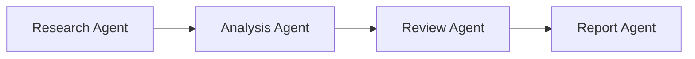

**코드:**
```
graph LR
    A[Research Agent] --> B[Analysis Agent]
    B --> C[Review Agent]
    C --> D[Report Agent]
```

### 2. Parallel Processing (병렬 처리)

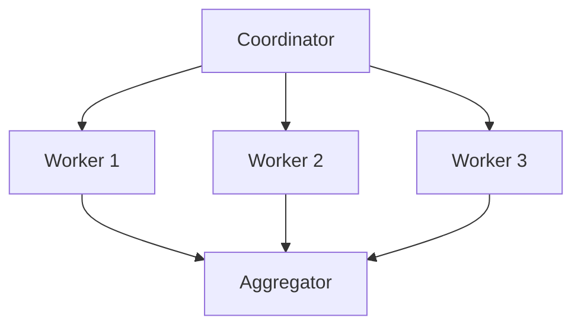

**코드:**
```
graph TD
    A[Coordinator] --> B[Worker 1]
    A --> C[Worker 2]
    A --> D[Worker 3]
    B --> E[Aggregator]
    C --> E
    D --> E
```

### 3. Conditional Branching (조건부 분기)

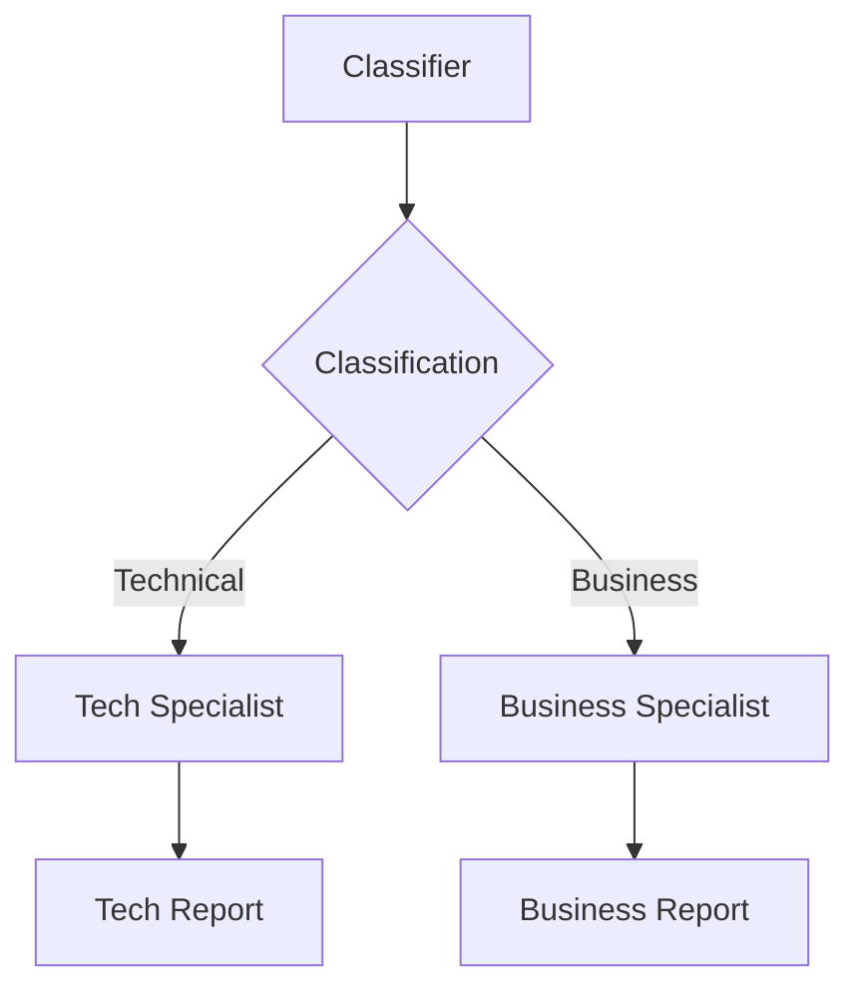

**코드:**
```
graph TD
    A[Classifier] --> B{Classification}
    B -->|Technical| C[Tech Specialist]
    B -->|Business| D[Business Specialist]
    C --> E[Tech Report]
    D --> F[Business Report]
```

### 4. Reflection Pattern (피드백 루프)

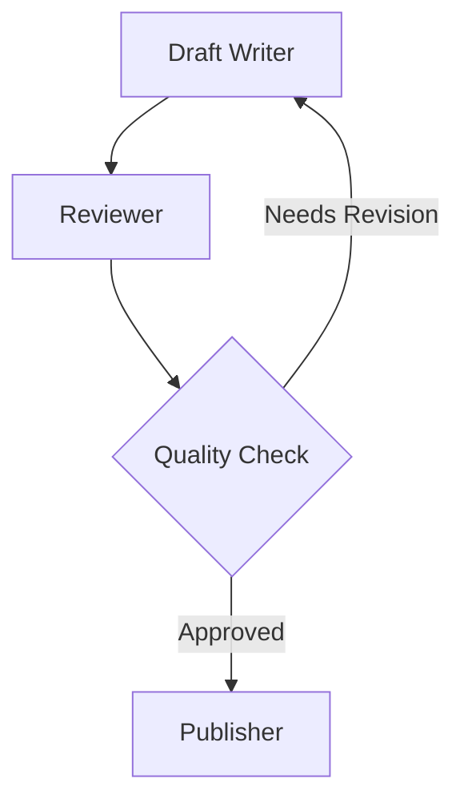

**코드:**
```
graph TD
    A[Draft Writer] --> B[Reviewer]
    B --> C{Quality Check}
    C -->|Needs Revision| A
    C -->|Approved| D[Publisher]
```

### 5. Multi-Agent with Tools (도구 통합)

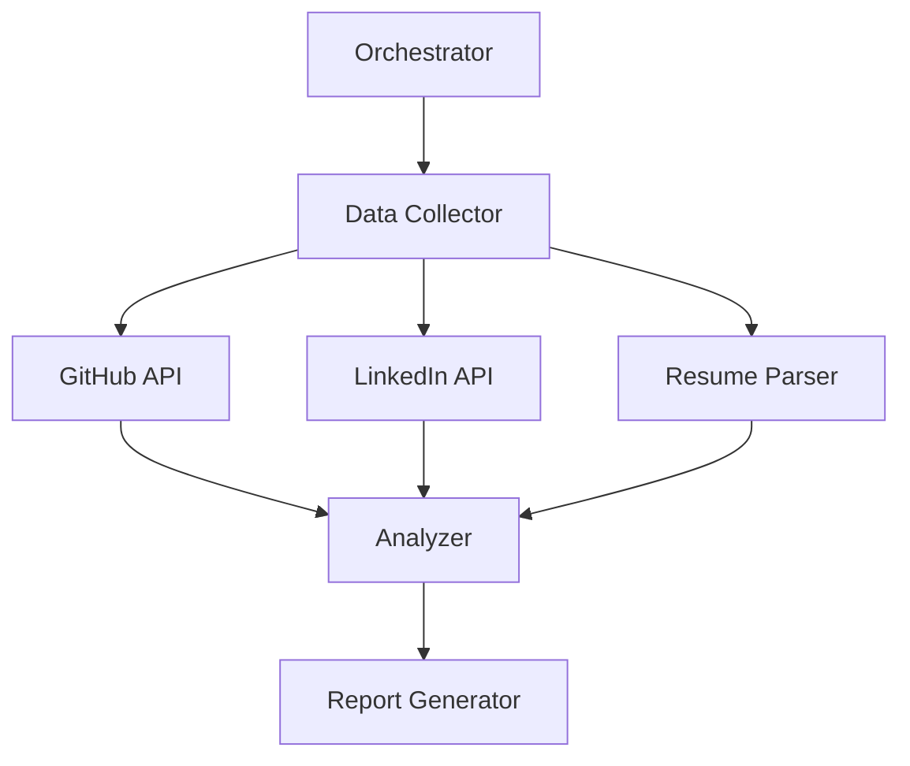

**코드:**
```
graph TD
    A[Orchestrator] --> B[Data Collector]
    B --> C[GitHub API]
    B --> D[LinkedIn API]
    B --> E[Resume Parser]
    C --> F[Analyzer]
    D --> F
    E --> F
    F --> G[Report Generator]
```

## 스타일링

### 노드 스타일
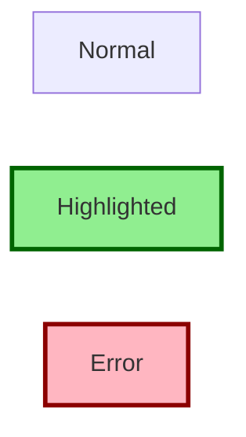

**코드:**
```
graph LR
    A[Normal]
    B[Highlighted]
    C[Error]
    
    style B fill:#90EE90,stroke:#006400,stroke-width:3px
    style C fill:#FFB6C1,stroke:#8B0000,stroke-width:3px
```

### 클래스 정의
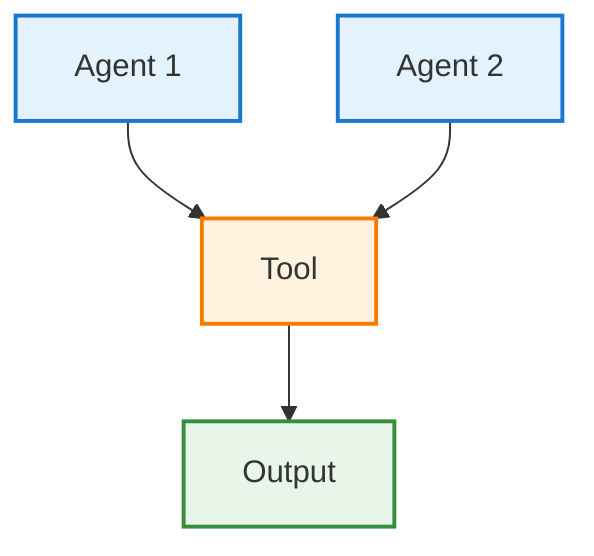

## 실전 예제

### 예제 1: 이메일 자동화 Agent

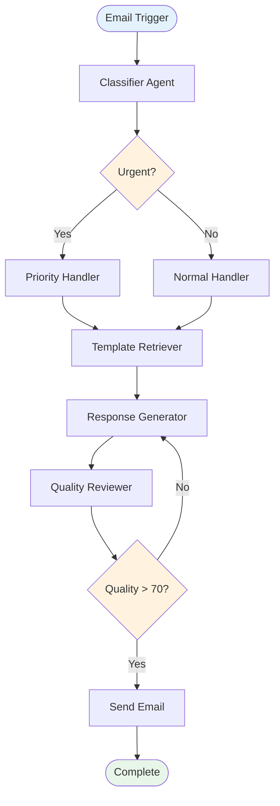

**코드:**
```
graph TD
    Start([Email Trigger]) --> Classify[Classifier Agent]
    Classify --> Urgent{Urgent?}
    Urgent -->|Yes| Priority[Priority Handler]
    Urgent -->|No| Normal[Normal Handler]
    Priority --> Template[Template Retriever]
    Normal --> Template
    Template --> Generate[Response Generator]
    Generate --> Review[Quality Reviewer]
    Review --> Check{Quality > 70?}
    Check -->|No| Generate
    Check -->|Yes| Send[Send Email]
    Send --> End([Complete])
    
    style Start fill:#E3F2FD
    style End fill:#E8F5E9
    style Urgent fill:#FFF3E0
    style Check fill:#FFF3E0
```

### 예제 2: 면접 준비 Agent


### 예제 3: AgentCore 통합


## 베스트 프랙티스

### 1. 명확한 노드 이름
```
❌ A[Node1] --> B[Node2]
✅ A[Data Collector] --> B[Analyzer]
```

### 2. 적절한 방향 선택
- **순차 작업**: `graph LR` (왼쪽→오른쪽)
- **계층 구조**: `graph TD` (위→아래)
- **피드백 루프**: `graph TD` (순환 표현 용이)

### 3. 조건 분기 명시
```
B{Condition} -->|True| C[Action1]
B -->|False| D[Action2]
```

### 4. 시작/종료 노드 구분
```
Start([Start]) --> Process[Process]
Process --> End([End])

style Start fill:#E3F2FD
style End fill:#E8F5E9
```

### 5. Agent vs Tool 구분
```
classDef agent fill:#E3F2FD,stroke:#1976D2
classDef tool fill:#FFF3E0,stroke:#F57C00

A[Agent]:::agent --> B[Tool]:::tool
```

## 복잡한 Graph 단순화

### Before (복잡)
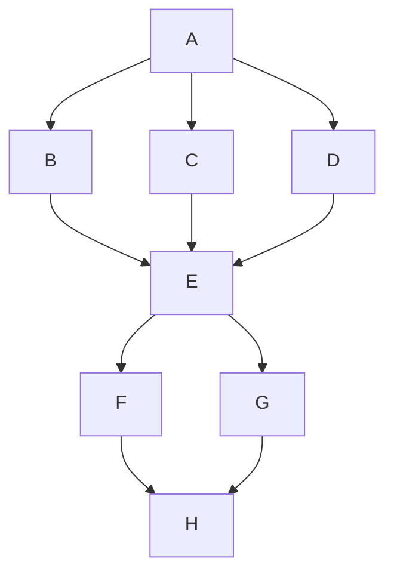

### After (서브그래프 사용)
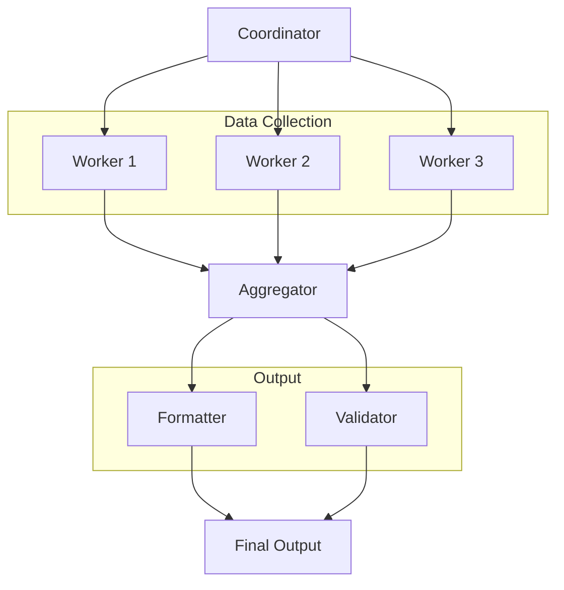

## Sequence Diagram (시퀀스 다이어그램)

Sequence Diagram은 Agent 간 시간 순서에 따른 메시지 흐름을 표현합니다.

### 기본 문법

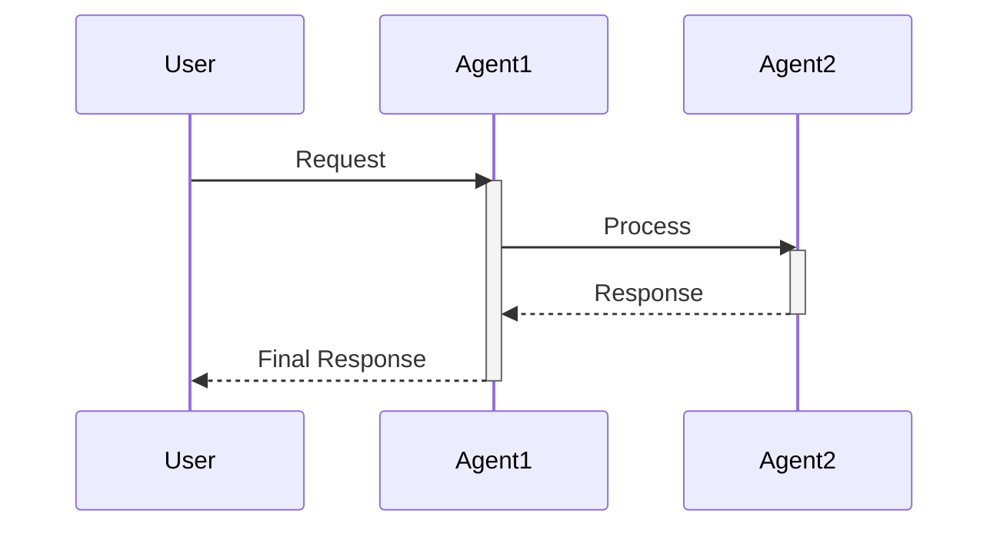

**코드:**
```
sequenceDiagram
    participant User
    participant Agent1
    participant Agent2

    User->>Agent1: Request
    activate Agent1
    Agent1->>Agent2: Process
    activate Agent2
    Agent2-->>Agent1: Response
    deactivate Agent2
    Agent1-->>User: Final Response
    deactivate Agent1
```

### activate/deactivate 베스트 프랙티스

**⚠️ 중요: activate와 deactivate는 반드시 쌍을 이뤄야 합니다.**

#### ✅ 올바른 예제

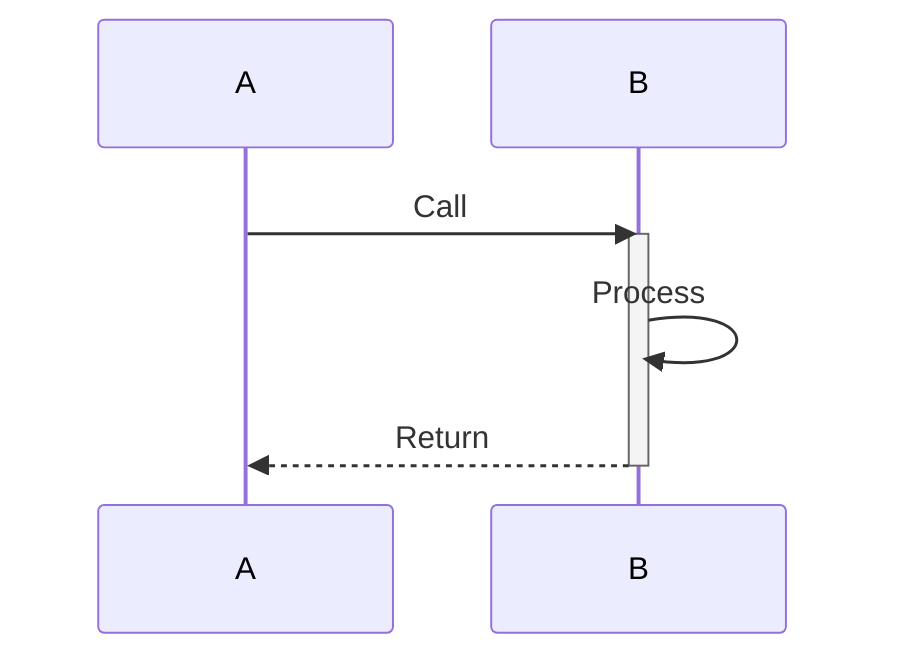

#### ❌ 잘못된 예제 (오류 발생!)

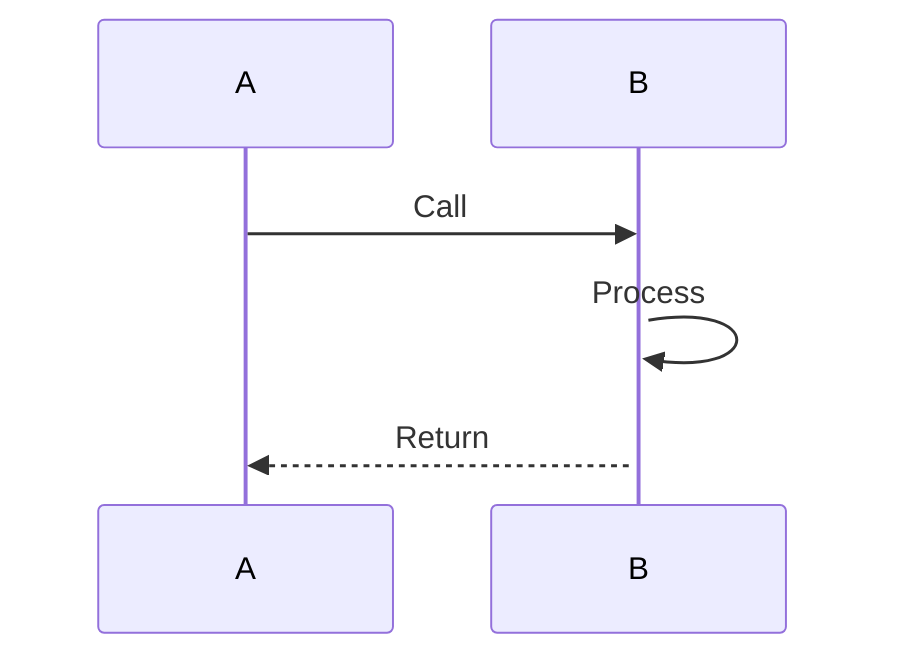

### alt/loop 블록에서의 activate/deactivate

**핵심 규칙: alt/loop 블록 내에서 activate/deactivate를 하면 각 분기마다 상태가 달라집니다.**

#### ✅ 방법 1: 블록 전에 deactivate

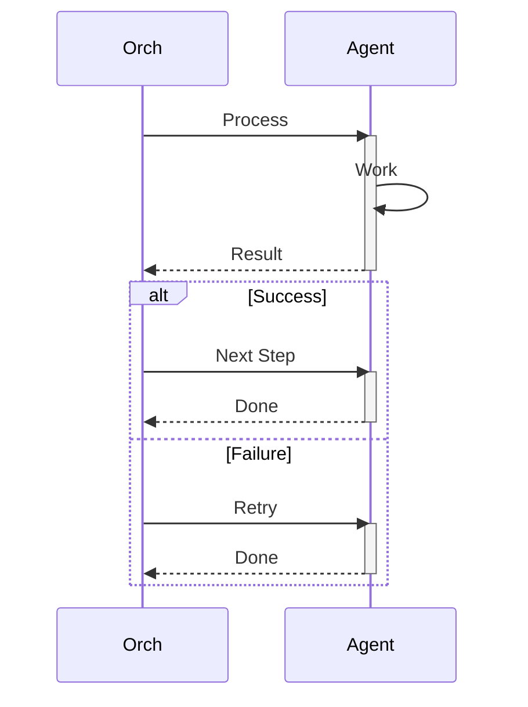

#### ❌ 방법 2: 블록 내에서 deactivate (loop에서 오류!)

```mermaid
sequenceDiagram
    participant Orch
    participant Agent

    loop Retry
        Orch->>Agent: Process
        activate Agent
        Agent-->>Orch: Result
        deactivate Agent  # 두 번째 반복에서 오류 발생!
    end
```

**오류 메시지**: `Error: Trying to inactivate an inactive participant`

#### ✅ Loop 올바른 사용법

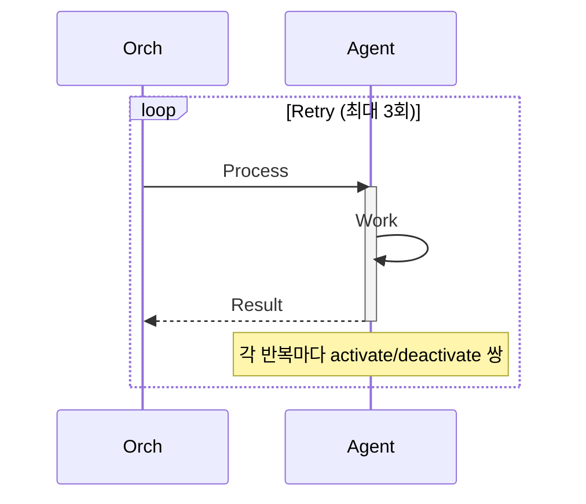

### Reflection Pattern (Sequence Diagram)

Reflection Pattern을 Sequence Diagram으로 표현할 때는 **alt 블록 전에 deactivate**하는 것이 안전합니다.

```mermaid
sequenceDiagram
    participant Orch
    participant Writer
    participant Reviewer
    participant State

    Orch->>Writer: Write Draft
    activate Writer
    Writer->>State: Save Draft
    Writer-->>Orch: Draft Complete
    deactivate Writer

    Orch->>Reviewer: Review
    activate Reviewer
    Reviewer->>State: Read Draft
    Reviewer->>Reviewer: Evaluate
    Reviewer->>State: Save Score
    Reviewer-->>Orch: Review Complete
    deactivate Reviewer

    alt Score >= 80
        Orch->>User: Publish
    else Score < 80 and Retry < 2
        Orch->>State: Increment Retry
        Orch->>Writer: Revise (with feedback)
        activate Writer
        Note over Writer,State: Use feedback from State
        Writer->>State: Save Revised Draft
        Writer-->>Orch: Revision Complete
        deactivate Writer
        Orch->>Reviewer: Re-review
        activate Reviewer
        Note over Reviewer: Repeat review process
        Reviewer->>State: Read Draft
        Reviewer->>Reviewer: Re-evaluate
        Reviewer-->>Orch: Re-review Complete
        deactivate Reviewer
    else Retry >= 2
        Orch->>User: Manual Review Needed
    end
```

**핵심 포인트**:
1. Reviewer를 **alt 블록 전에 deactivate** (line 17)
2. 각 분기에서 필요 시 **다시 activate** (line 24, 29)
3. 각 분기 끝에서 **반드시 deactivate** (line 28, 33)

### 일반적인 오류와 해결책

#### 오류 1: "Trying to inactivate an inactive participant"

**원인**: 이미 deactivate된 participant를 다시 deactivate 시도

**해결책**:
```
❌ 잘못된 코드:
    activate Agent
    deactivate Agent
    # ... 중간 코드 ...
    deactivate Agent  # 오류!

✅ 올바른 코드:
    activate Agent
    # ... 작업 ...
    deactivate Agent
    # 다시 사용 시 재활성화
    activate Agent
    # ... 작업 ...
    deactivate Agent
```

#### 오류 2: alt 블록에서 상태 불일치

**원인**: alt 분기마다 activate/deactivate 상태가 달라짐

**해결책**: alt 블록 **전에** deactivate
```
✅ 올바른 패턴:
    activate Agent
    Agent-->>Orch: Result
    deactivate Agent  # alt 블록 전에 deactivate!

    alt Case1
        # 필요 시 재활성화
    else Case2
        # 필요 시 재활성화
    end
```

#### 오류 3: loop에서 중복 deactivate

**원인**: loop 반복 시 이전 반복에서 이미 deactivate됨

**해결책**: loop 내에서 매 반복마다 activate/deactivate 쌍 유지
```
✅ 올바른 패턴:
    loop Retry
        activate Agent  # 매 반복마다 activate
        Agent->>Agent: Work
        deactivate Agent  # 매 반복마다 deactivate
    end
```

### 메시지 타입

```mermaid
sequenceDiagram
    A->>B: 동기 호출 (실선 화살표)
    A-->>B: 비동기 응답 (점선 화살표)
    A-)B: 비동기 호출 (열린 화살표)
    A-xB: 실패한 호출 (X 표시)
```

### Note와 Rect 활용

```mermaid
sequenceDiagram
    participant A
    participant B

    Note over A,B: 전체 영역에 대한 설명

    rect rgb(240, 240, 240)
        Note over A,B: 중요한 프로세스 영역
        A->>B: Important Process
        activate B
        B-->>A: Result
        deactivate B
    end

    Note right of B: 오른쪽 노트
    Note left of A: 왼쪽 노트
```

## 명세서 작성 시 권장 사항

1. **개요 다이어그램**: 전체 워크플로우 (5-10개 노드)
2. **상세 다이어그램**: 복잡한 부분만 확대 (선택)
3. **AgentCore 통합**: 서비스 연결 관계 명시
4. **조건 분기**: 의사결정 로직 시각화
5. **피드백 루프**: 반복 횟수 제한 명시
6. **Sequence Diagram**: Agent 간 실행 흐름과 State 공유 표현
7. **activate/deactivate 쌍**: 반드시 확인하여 오류 방지

## 템플릿

### 기본 템플릿
```
graph TD
    Start([Trigger]) --> Agent1[Agent Name]
    Agent1 --> Agent2[Agent Name]
    Agent2 --> End([Output])
    
    style Start fill:#E3F2FD
    style End fill:#E8F5E9
```

### AgentCore 템플릿
```
graph TD
    User([User]) --> Runtime[AgentCore Runtime]
    Runtime --> Memory[(Memory)]
    Runtime --> Agent[Strands Agent]
    Agent --> Gateway[Gateway]
    Gateway --> Tools[Tools]
    Tools --> Agent
    Memory --> Agent
    Agent --> Response([Response])
    
    style Runtime fill:#E3F2FD,stroke:#1976D2,stroke-width:3px
    style Memory fill:#FFF3E0,stroke:#F57C00,stroke-width:2px
    style Gateway fill:#FFF3E0,stroke:#F57C00,stroke-width:2px
```
