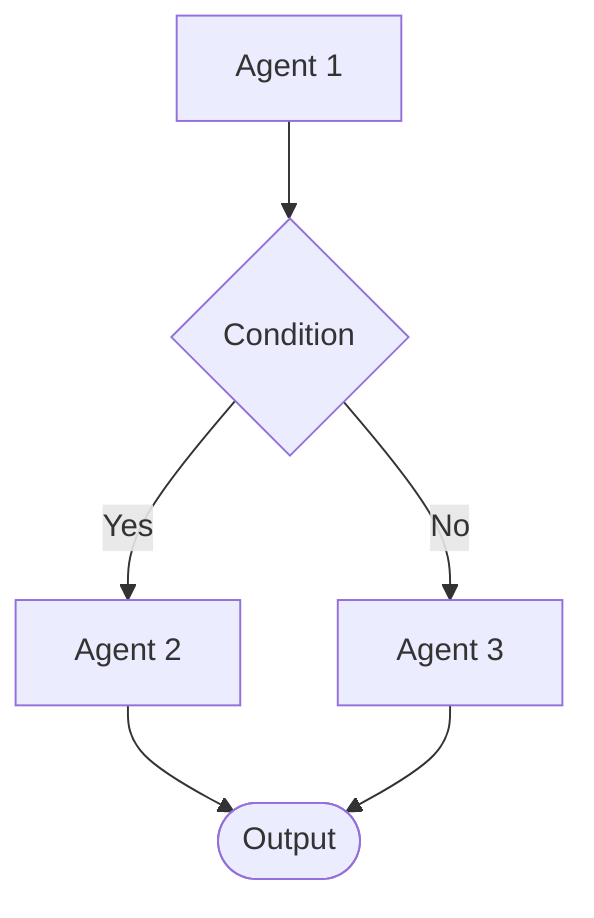
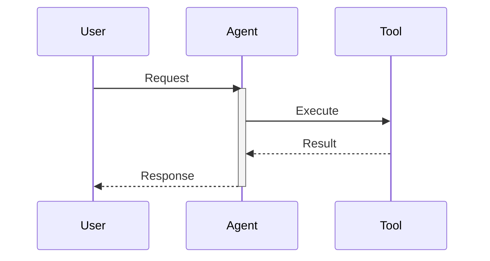

# Mermaid Diagrams for Strands Agent

Strands Agent의 Graph 구조를 Mermaid 다이어그램으로 시각화하는 방법을 제공합니다.

**중요: 다이어그램에 HTML 태그 금지.**

## 다이어그램 유형

| 유형 | 용도 | Reference |
|------|------|-----------|
| **Flowchart** | 노드 기반 워크플로우 | `flowchart-basics.md` |
| **패턴 예제** | Sequential, Parallel, Reflection 등 | `pattern-examples.md` |
| **스타일링** | 색상, 클래스, 서브그래프 | `styling.md` |
| **Sequence** | 시간 순서 메시지 흐름 | `sequence-diagrams.md` |
| **템플릿** | 복사해서 사용할 코드 | `templates.md` |

## Quick Reference

### Flowchart 기본


### Sequence Diagram 기본


## 패턴 선택 가이드

| 패턴 | Flowchart | Sequence |
|------|-----------|----------|
| Sequential | `graph LR` | O |
| Parallel | `graph TD` + 서브그래프 | O |
| Reflection | `graph TD` + 순환 | O (alt 블록) |
| Multi-Agent | `graph TD` | O |

## Available References

상세 구현 가이드가 필요하면 `skill_tool`로 로드:

- `flowchart-basics.md` - 방향, 노드 형태, 베스트 프랙티스
- `pattern-examples.md` - 5가지 패턴별 다이어그램 예제
- `styling.md` - 색상, 클래스, 서브그래프
- `sequence-diagrams.md` - activate/deactivate, alt/loop
- `templates.md` - 복사해서 사용할 템플릿

**사용 예시:**
```
skill_tool(skill_name="mermaid-diagrams", reference="pattern-examples.md")
```

## 명세서 작성 권장 사항

1. **개요 다이어그램**: 전체 워크플로우 (5-10개 노드)
2. **조건 분기**: 의사결정 로직 시각화
3. **피드백 루프**: 반복 횟수 제한 명시
4. **activate/deactivate**: 반드시 쌍으로 사용
