# Mermaid Diagrams for Strands Agent

Strands Agent의 Graph 구조를 Mermaid 다이어그램으로 시각화하는 방법을 제공합니다.

## 기본 문법

### Graph 방향
```mermaid
graph TD    # Top Down (위에서 아래)
graph LR    # Left Right (왼쪽에서 오른쪽)
graph BT    # Bottom Top (아래에서 위)
graph RL    # Right Left (오른쪽에서 왼쪽)
```

### 노드 형태
```mermaid
A[사각형]
B(둥근 사각형)
C([스타디움])
D[[서브루틴]]
E[(데이터베이스)]
F((원형))
G>비대칭]
H{다이아몬드}
I{{육각형}}
J[/평행사변형/]
K[\평행사변형\]
L[/사다리꼴\]
M[\사다리꼴/]
```

## Strands Agent 패턴별 다이어그램

### 1. Sequential Pipeline (순차 파이프라인)

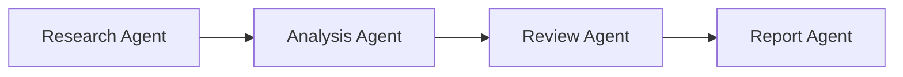

**코드:**
```
graph LR
    A[Research Agent] --> B[Analysis Agent]
    B --> C[Review Agent]
    C --> D[Report Agent]
```

### 2. Parallel Processing (병렬 처리)

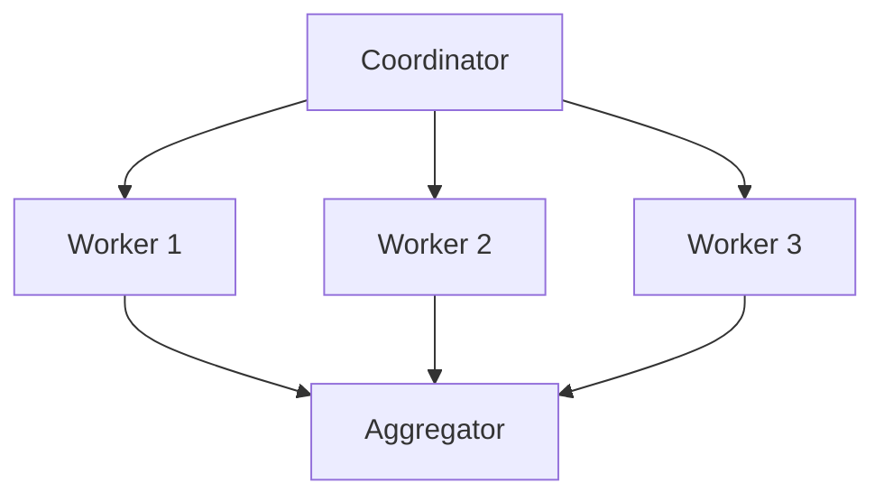

**코드:**
```
graph TD
    A[Coordinator] --> B[Worker 1]
    A --> C[Worker 2]
    A --> D[Worker 3]
    B --> E[Aggregator]
    C --> E
    D --> E
```

### 3. Conditional Branching (조건부 분기)

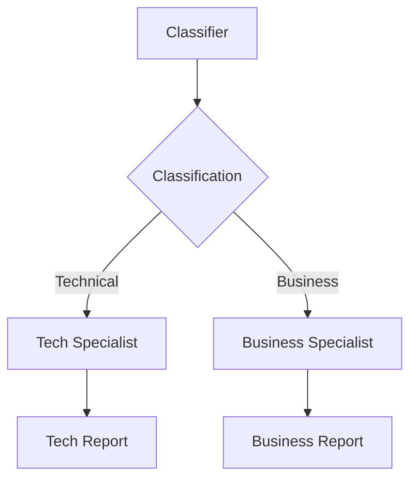

**코드:**
```
graph TD
    A[Classifier] --> B{Classification}
    B -->|Technical| C[Tech Specialist]
    B -->|Business| D[Business Specialist]
    C --> E[Tech Report]
    D --> F[Business Report]
```

### 4. Reflection Pattern (피드백 루프)

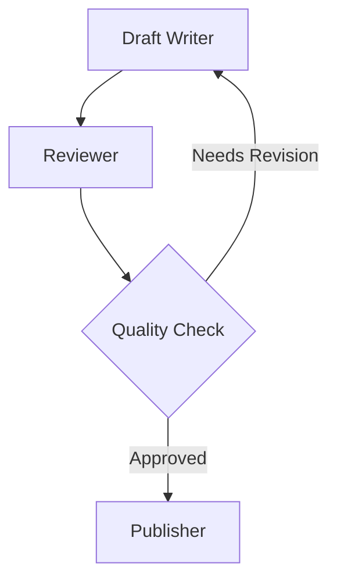

**코드:**
```
graph TD
    A[Draft Writer] --> B[Reviewer]
    B --> C{Quality Check}
    C -->|Needs Revision| A
    C -->|Approved| D[Publisher]
```

### 5. Multi-Agent with Tools (도구 통합)

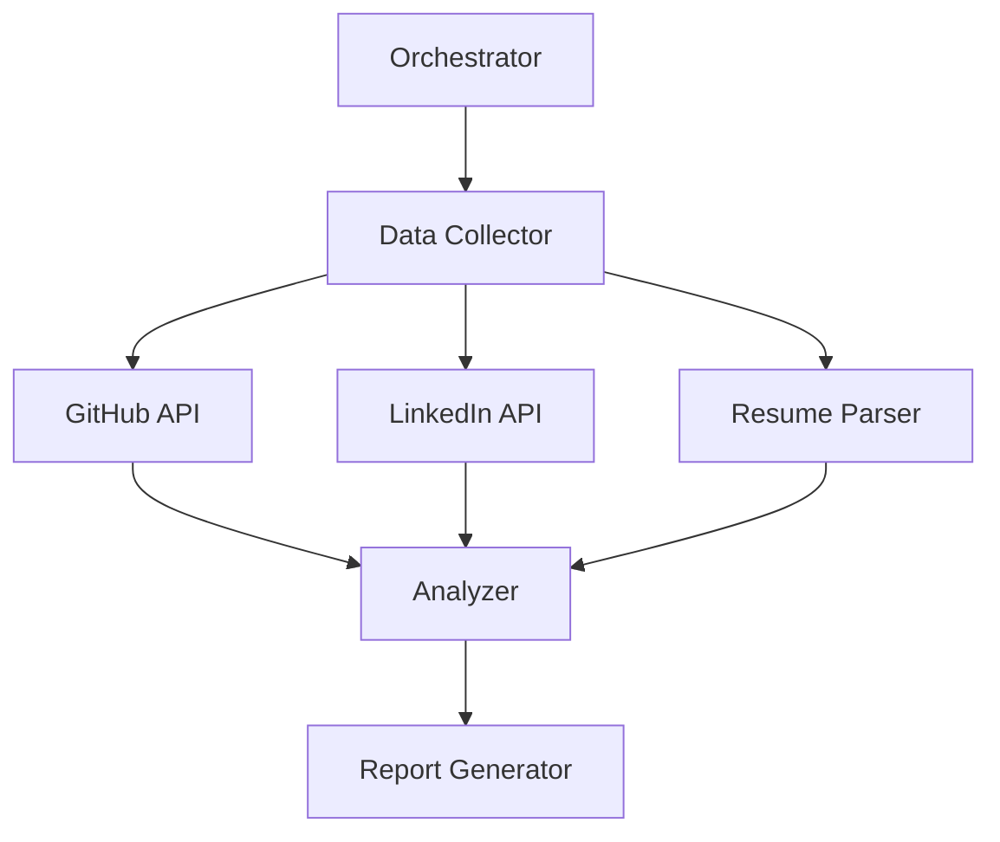

**코드:**
```
graph TD
    A[Orchestrator] --> B[Data Collector]
    B --> C[GitHub API]
    B --> D[LinkedIn API]
    B --> E[Resume Parser]
    C --> F[Analyzer]
    D --> F
    E --> F
    F --> G[Report Generator]
```

## 스타일링

### 노드 스타일
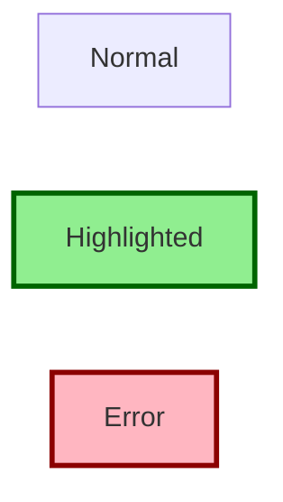

**코드:**
```
graph LR
    A[Normal]
    B[Highlighted]
    C[Error]
    
    style B fill:#90EE90,stroke:#006400,stroke-width:3px
    style C fill:#FFB6C1,stroke:#8B0000,stroke-width:3px
```

### 클래스 정의
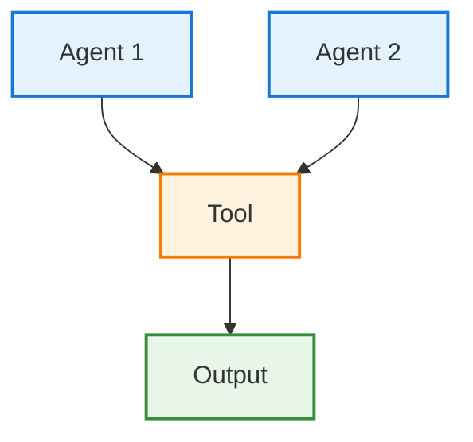

## 실전 예제

### 예제 1: 이메일 자동화 Agent


**코드:**
```
graph TD
    Start([Email Trigger]) --> Classify[Classifier Agent]
    Classify --> Urgent{Urgent?}
    Urgent -->|Yes| Priority[Priority Handler]
    Urgent -->|No| Normal[Normal Handler]
    Priority --> Template[Template Retriever]
    Normal --> Template
    Template --> Generate[Response Generator]
    Generate --> Review[Quality Reviewer]
    Review --> Check{Quality > 70?}
    Check -->|No| Generate
    Check -->|Yes| Send[Send Email]
    Send --> End([Complete])
    
    style Start fill:#E3F2FD
    style End fill:#E8F5E9
    style Urgent fill:#FFF3E0
    style Check fill:#FFF3E0
```

### 예제 2: 면접 준비 Agent

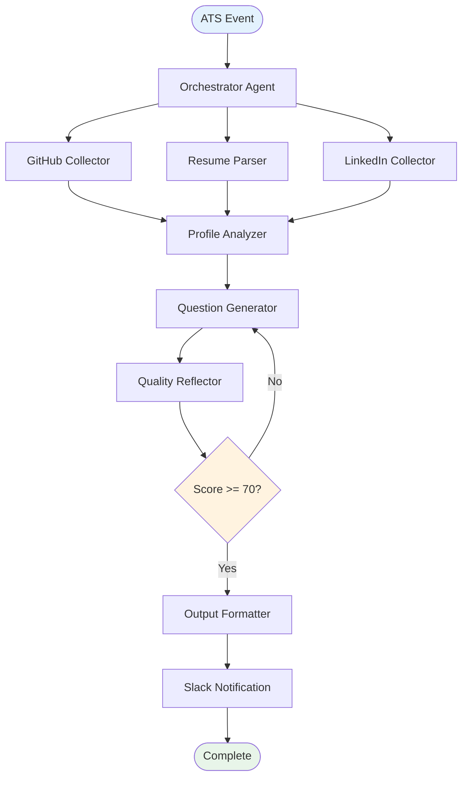

### 예제 3: AgentCore 통합

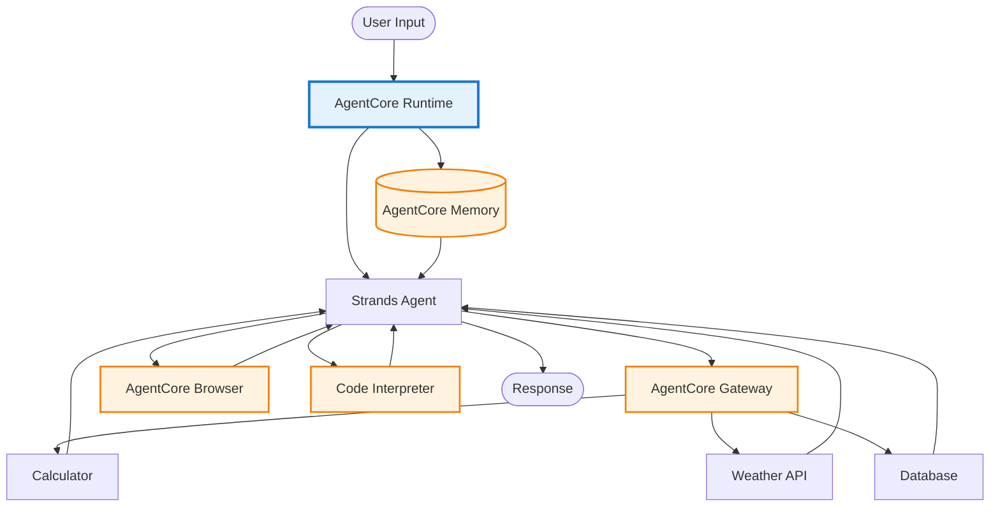

## 베스트 프랙티스

### 1. 명확한 노드 이름
```
❌ A[Node1] --> B[Node2]
✅ A[Data Collector] --> B[Analyzer]
```

### 2. 적절한 방향 선택
- **순차 작업**: `graph LR` (왼쪽→오른쪽)
- **계층 구조**: `graph TD` (위→아래)
- **피드백 루프**: `graph TD` (순환 표현 용이)

### 3. 조건 분기 명시
```
B{Condition} -->|True| C[Action1]
B -->|False| D[Action2]
```

### 4. 시작/종료 노드 구분
```
Start([Start]) --> Process[Process]
Process --> End([End])

style Start fill:#E3F2FD
style End fill:#E8F5E9
```

### 5. Agent vs Tool 구분
```
classDef agent fill:#E3F2FD,stroke:#1976D2
classDef tool fill:#FFF3E0,stroke:#F57C00

A[Agent]:::agent --> B[Tool]:::tool
```

## 복잡한 Graph 단순화

### Before (복잡)
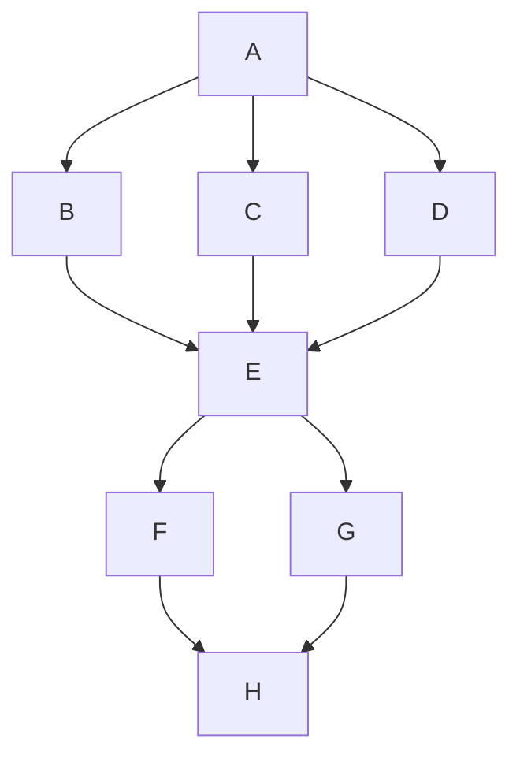

### After (서브그래프 사용)
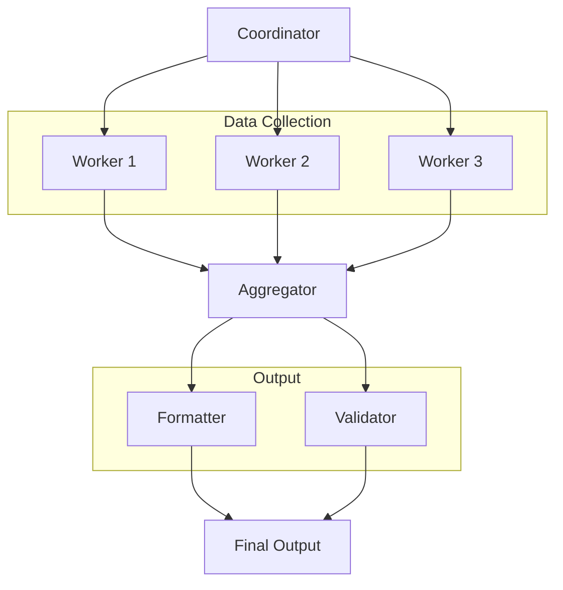

## 명세서 작성 시 권장 사항

1. **개요 다이어그램**: 전체 워크플로우 (5-10개 노드)
2. **상세 다이어그램**: 복잡한 부분만 확대 (선택)
3. **AgentCore 통합**: 서비스 연결 관계 명시
4. **조건 분기**: 의사결정 로직 시각화
5. **피드백 루프**: 반복 횟수 제한 명시

## 템플릿

### 기본 템플릿
```
graph TD
    Start([Trigger]) --> Agent1[Agent Name]
    Agent1 --> Agent2[Agent Name]
    Agent2 --> End([Output])
    
    style Start fill:#E3F2FD
    style End fill:#E8F5E9
```

### AgentCore 템플릿
```
graph TD
    User([User]) --> Runtime[AgentCore Runtime]
    Runtime --> Memory[(Memory)]
    Runtime --> Agent[Strands Agent]
    Agent --> Gateway[Gateway]
    Gateway --> Tools[Tools]
    Tools --> Agent
    Memory --> Agent
    Agent --> Response([Response])
    
    style Runtime fill:#E3F2FD,stroke:#1976D2,stroke-width:3px
    style Memory fill:#FFF3E0,stroke:#F57C00,stroke-width:2px
    style Gateway fill:#FFF3E0,stroke:#F57C00,stroke-width:2px
```
