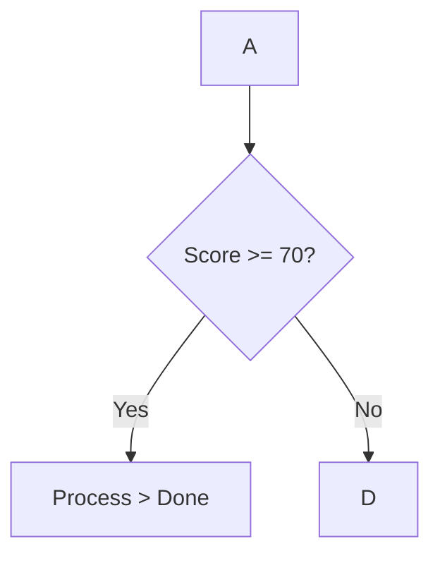
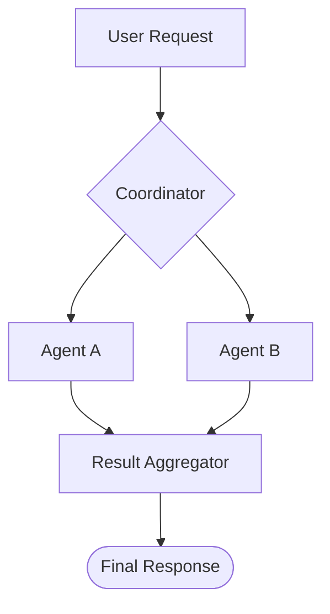
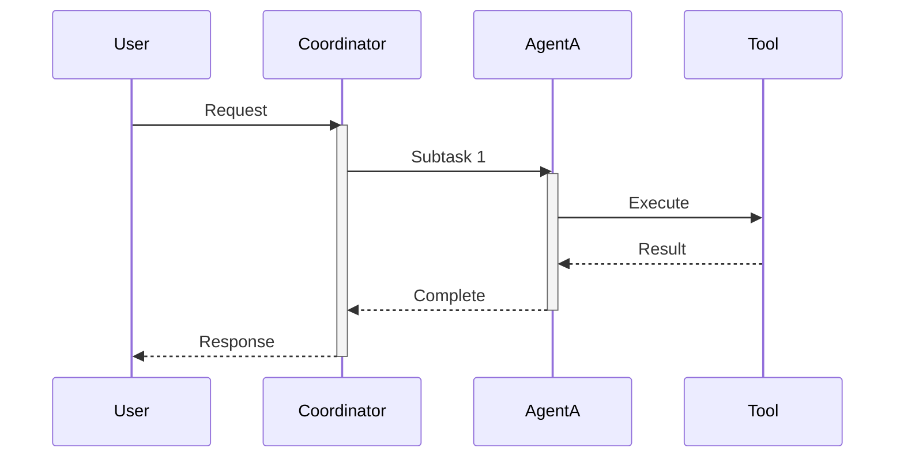
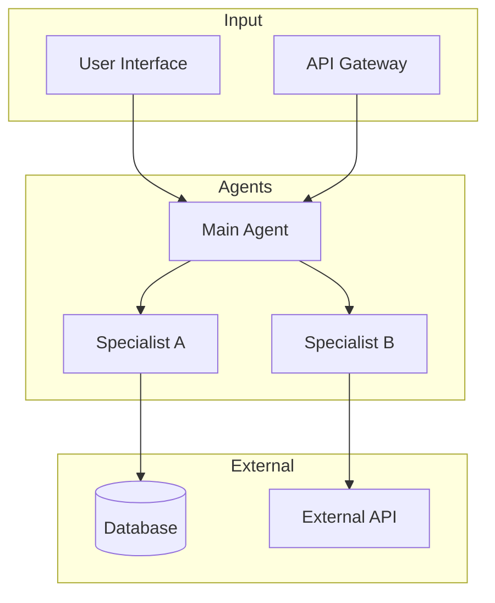

# Mermaid Diagrams for Agent Workflows

AI Agent의 워크플로우를 Mermaid 다이어그램으로 시각화하는 방법을 제공합니다.
프레임워크에 독립적이며 추상적인 Agent 흐름을 표현합니다.

**중요: 다이어그램에 HTML 태그 금지.**

## 특수 문자 처리 (필수)

Mermaid에서 특수 문자는 파싱 오류를 일으킵니다. **반드시 따옴표로 감싸세요:**

| 잘못된 예 | 올바른 예 |
|-----------|-----------|
| `{Score >= 70?}` | `{"Score >= 70?"}` |
| `[Data > 100]` | `["Data > 100"]` |
| `(A & B)` | `["A & B"]` |



## 다이어그램 유형

| 유형 | 용도 | Reference |
|------|------|-----------|
| **Flowchart** | Agent 워크플로우, 노드 기반 흐름 | `flowchart-basics.md` |
| **Sequence** | 시간 순서 메시지 흐름, Agent 간 통신 | `sequence-diagrams.md` |
| **패턴 예제** | Sequential, Parallel, Reflection 등 | `pattern-examples.md` |
| **스타일링** | 색상, 클래스, 서브그래프 | `styling.md` |
| **템플릿** | 복사해서 사용할 코드 | `templates.md` |

## Quick Reference

### Agent Workflow (Flowchart)


### Agent Communication (Sequence)


### Architecture Overview


## 패턴별 다이어그램 가이드

| 패턴 | Flowchart | Sequence |
|------|-----------|----------|
| Sequential | `graph LR` 또는 `TD` | O |
| Parallel | `graph TD` + 서브그래프 | O |
| Reflection | `graph TD` + 순환 화살표 | O (alt 블록) |
| Multi-Agent | `graph TD` | O |
| Human-in-Loop | `graph TD` + 사람 노드 | O |

## Available References

상세 구현 가이드가 필요하면 `skill_tool`로 로드:

- `flowchart-basics.md` - 방향, 노드 형태, 베스트 프랙티스
- `pattern-examples.md` - 5가지 패턴별 다이어그램 예제
- `styling.md` - 색상, 클래스, 서브그래프
- `sequence-diagrams.md` - activate/deactivate, alt/loop
- `templates.md` - 복사해서 사용할 템플릿

**사용 예시:**
```
skill_tool(skill_name="mermaid-diagrams", reference="pattern-examples.md")
```

## 명세서 작성 권장 사항

1. **Agent Workflow**: 전체 Agent 간 흐름 (5-10개 노드)
2. **Sequence Diagram**: User → Agent → Tool 간 상호작용
3. **Architecture**: 시스템 컴포넌트 개요 (추상적)
4. **조건 분기**: 의사결정 로직 시각화
5. **피드백 루프**: 반복 횟수 제한 명시
6. **activate/deactivate**: 반드시 쌍으로 사용
