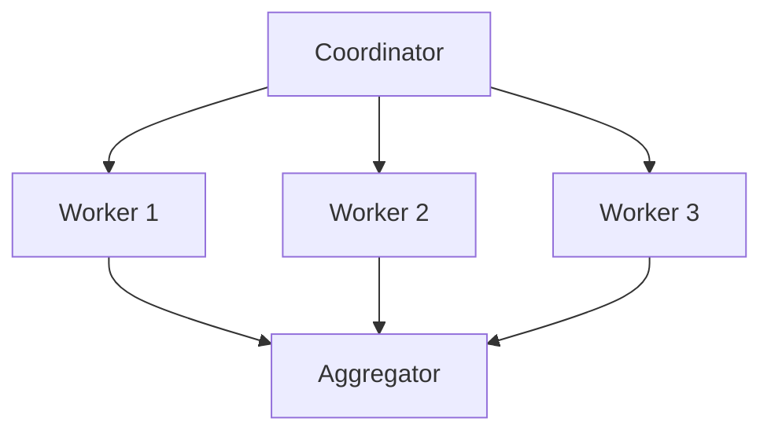
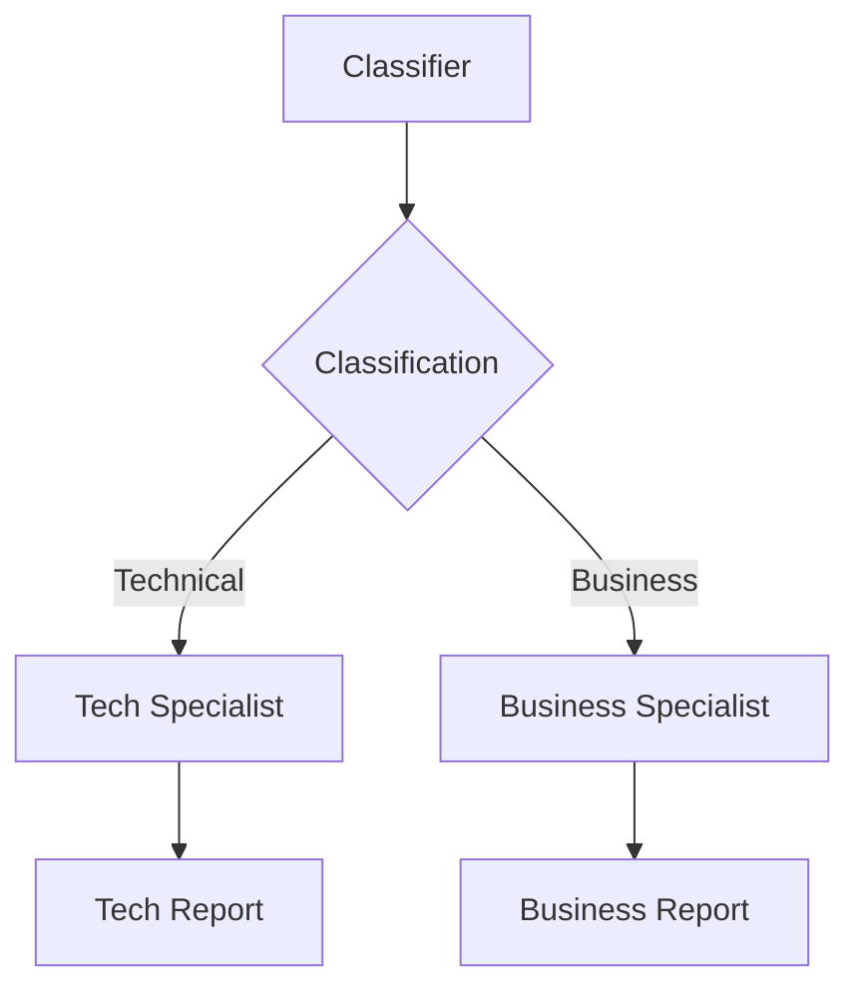
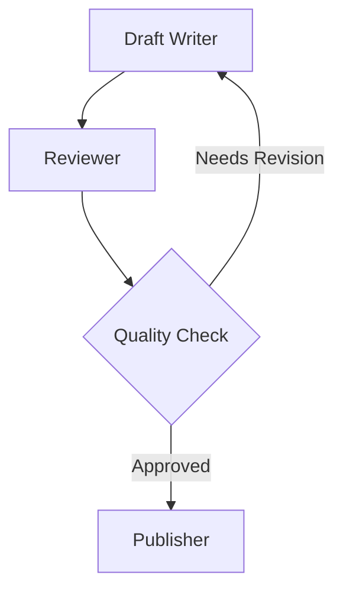
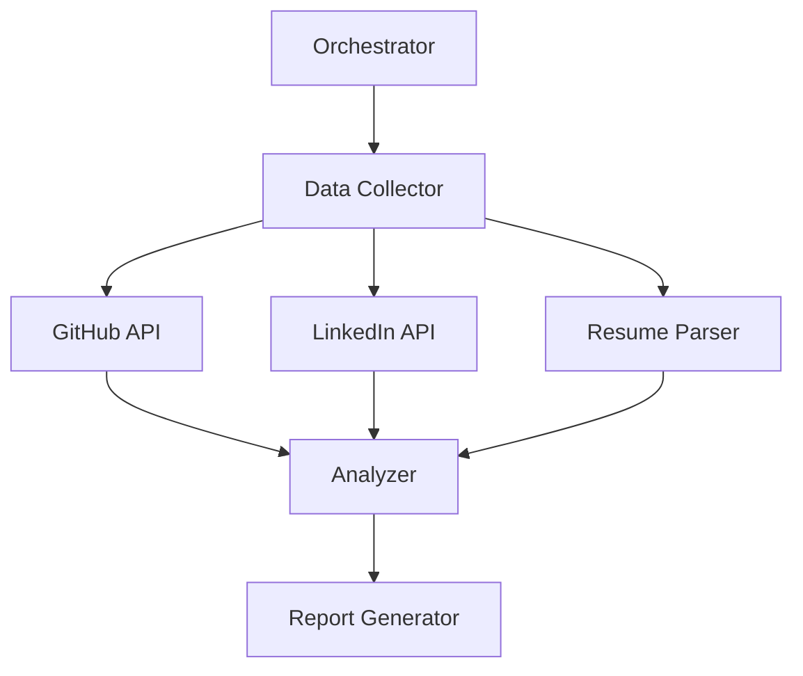
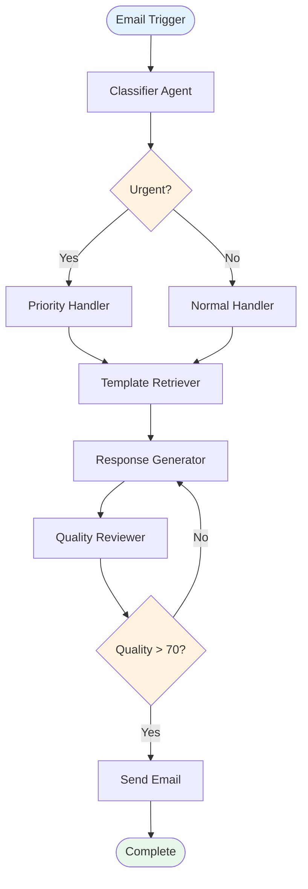
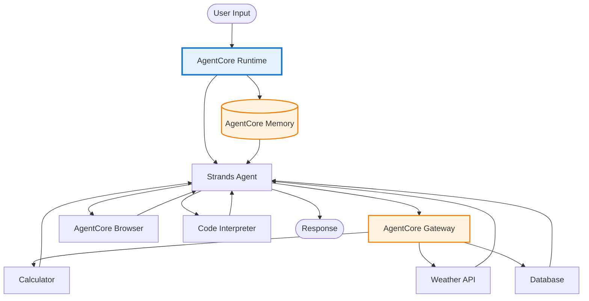

# Strands Agent 패턴별 다이어그램

## 1. Sequential Pipeline (순차 파이프라인)

## 2. Parallel Processing (병렬 처리)

## 3. Conditional Branching (조건부 분기)

## 4. Reflection Pattern (피드백 루프)

## 5. Multi-Agent with Tools (도구 통합)

## 실전 예제: 이메일 자동화 Agent

## 실전 예제: AgentCore 통합

