# Agent 패턴별 다이어그램

프레임워크 독립적인 Agent 워크플로우 다이어그램 예제입니다.

## 1. Sequential Pipeline (순차 파이프라인)

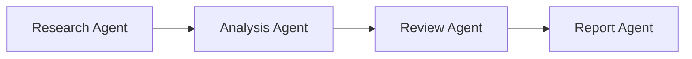

## 2. Parallel Processing (병렬 처리)

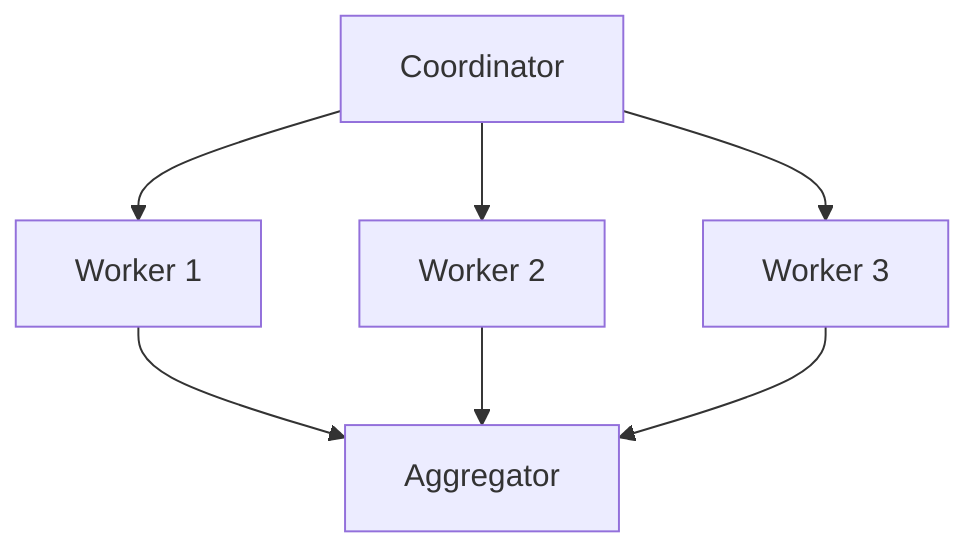

## 3. Conditional Branching (조건부 분기)

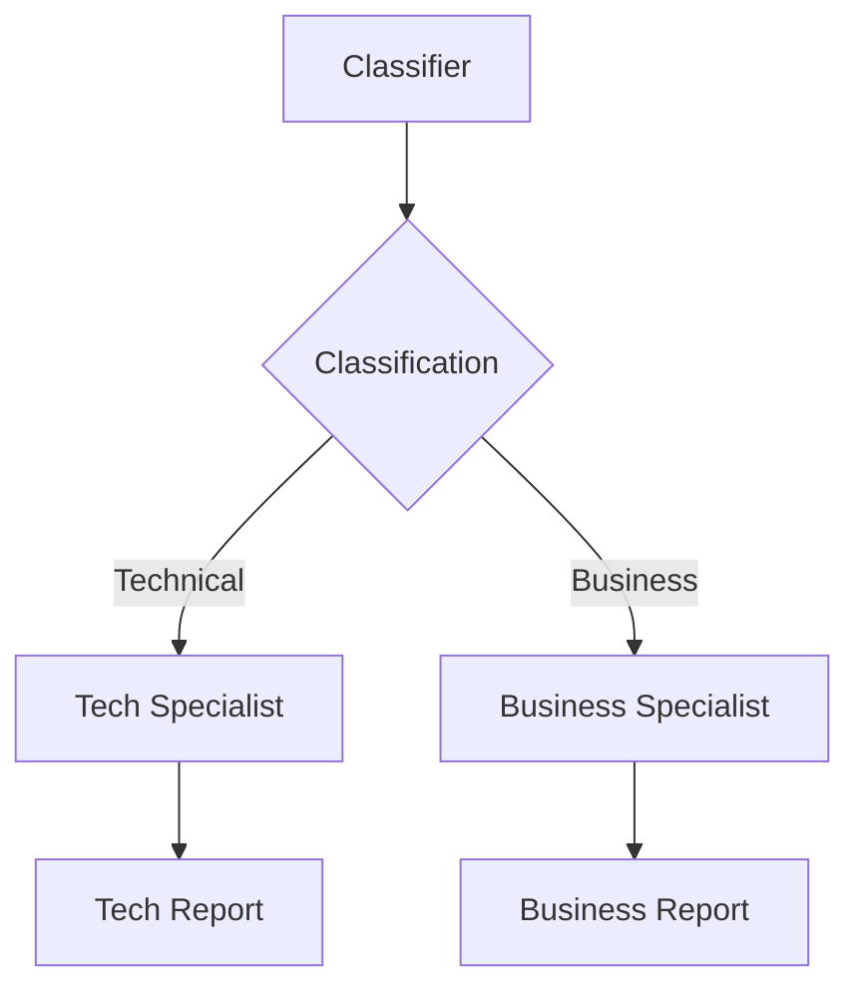

## 4. Reflection Pattern (피드백 루프)

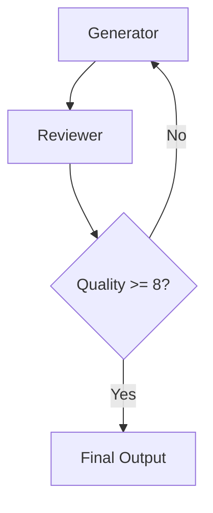

## 5. ReAct Pattern (추론 + 행동)

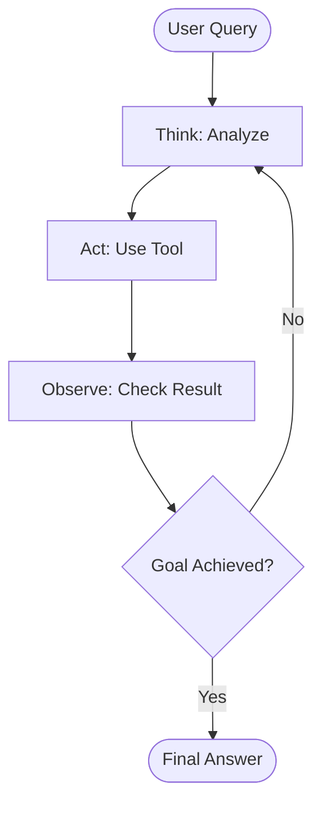

## 6. Multi-Agent Collaboration (협업)

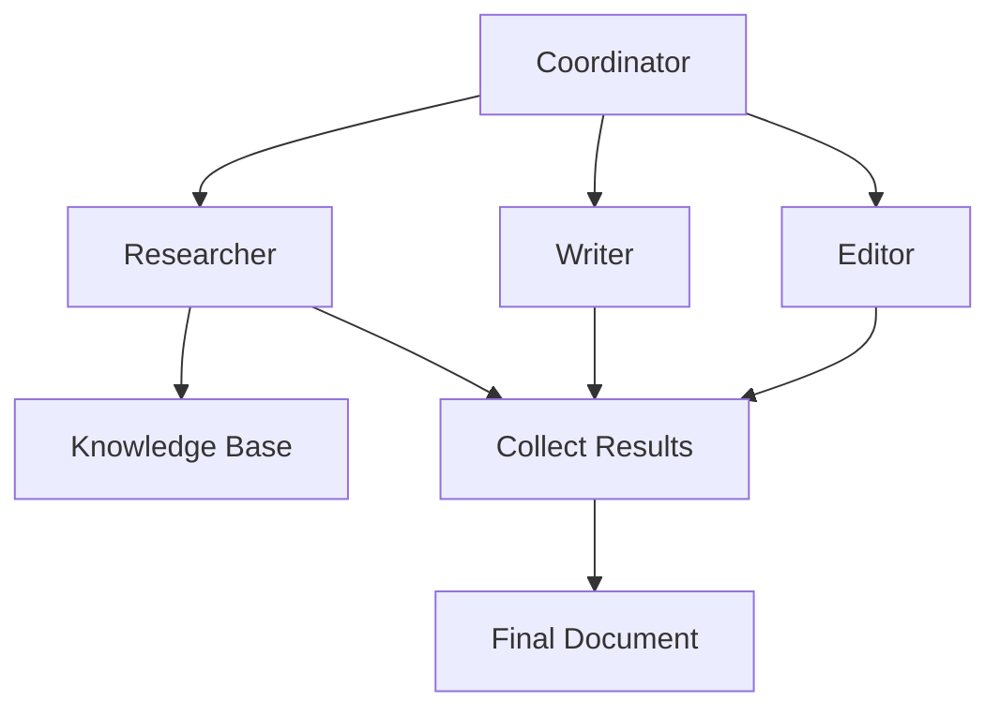

## 7. Human-in-the-Loop (사람 개입)

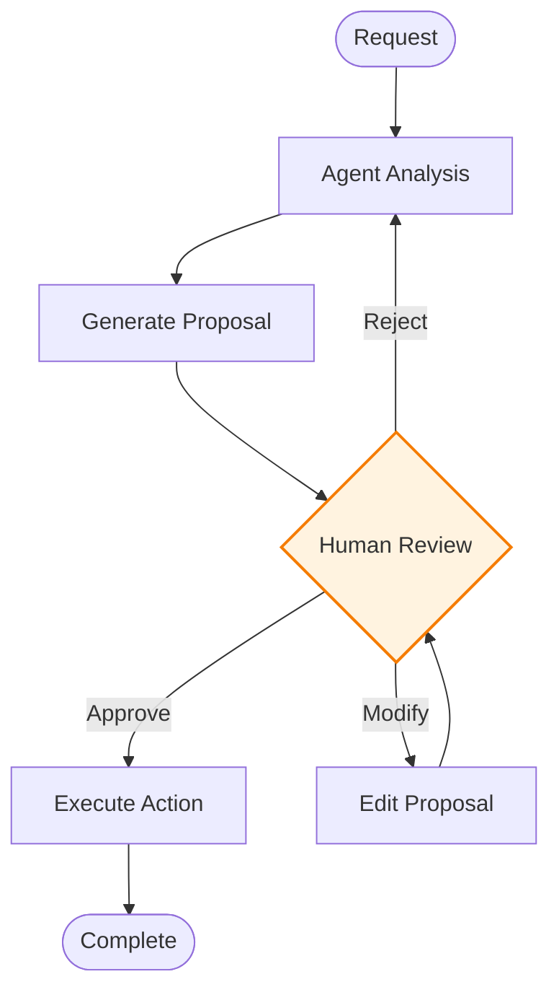

## 8. Tool Use Pattern (도구 활용)

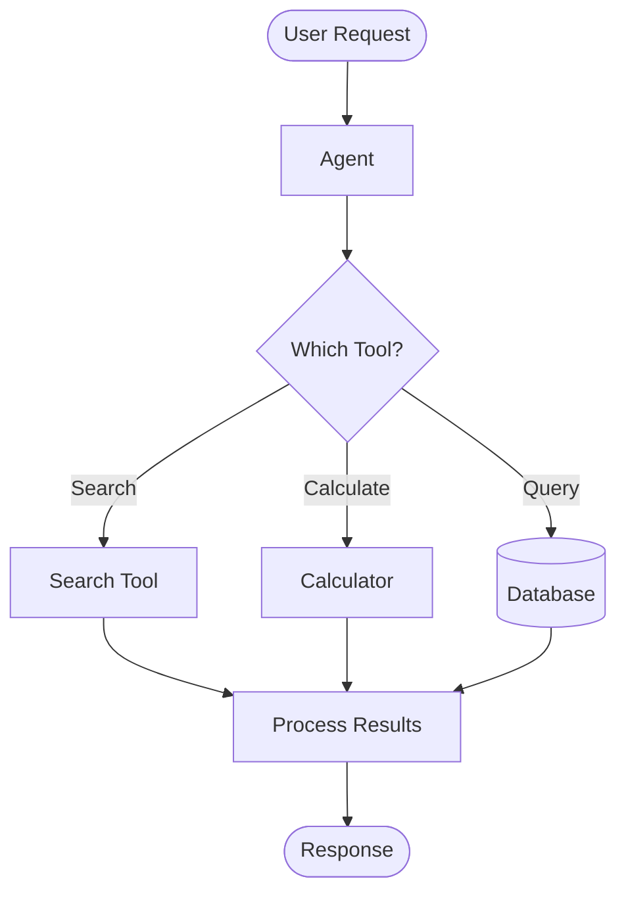

## 실전 예제: 이메일 자동화 Agent

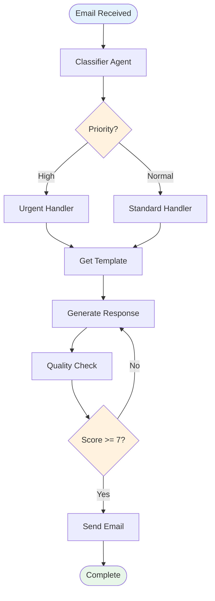

## 실전 예제: 콘텐츠 제작 파이프라인

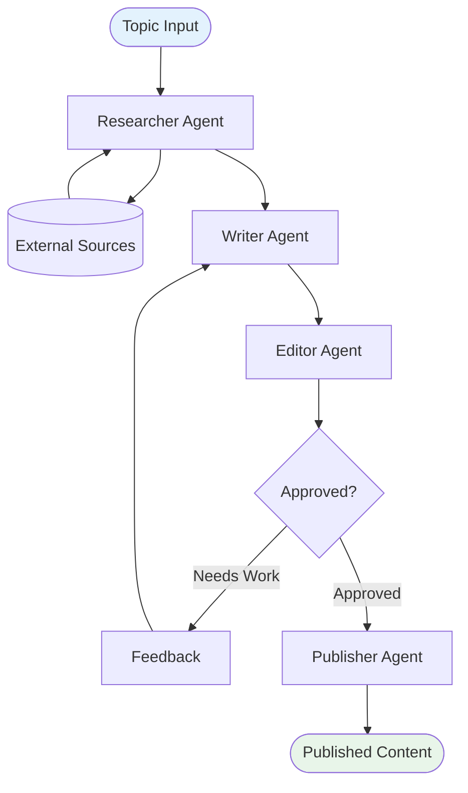

## 실전 예제: 데이터 분석 시스템

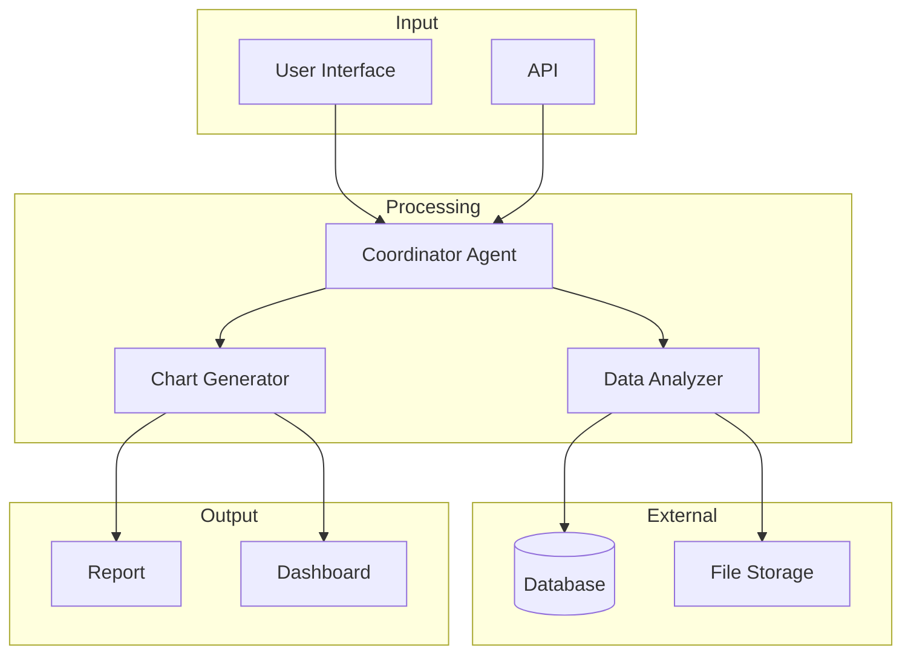
