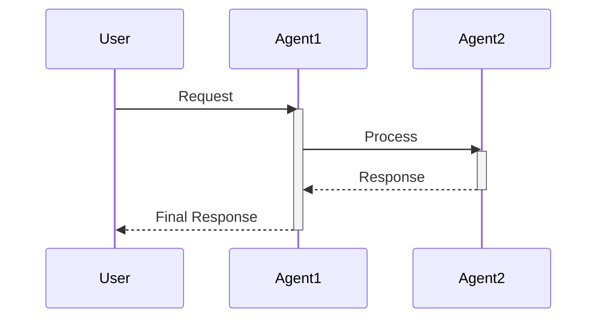
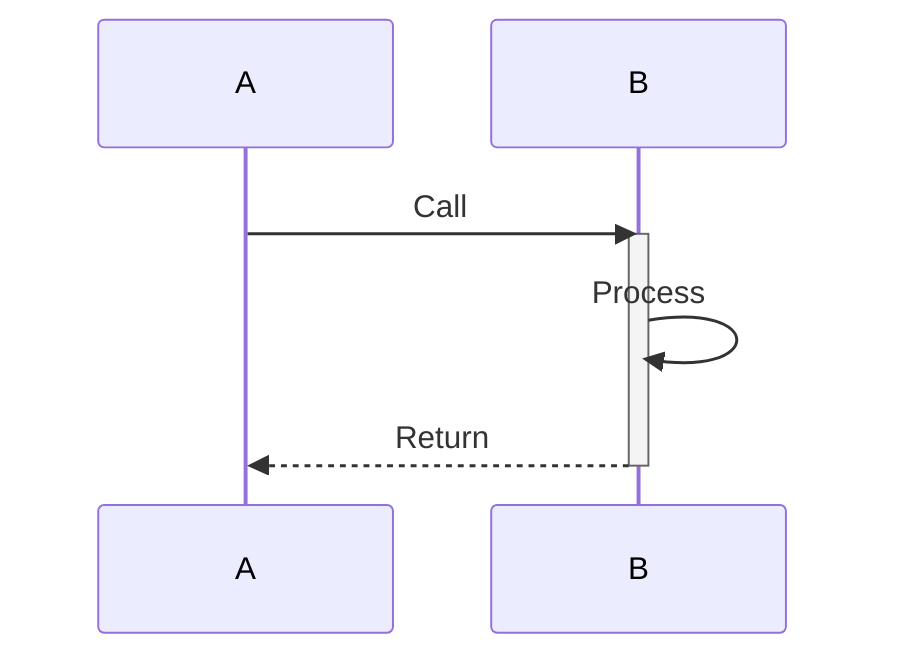
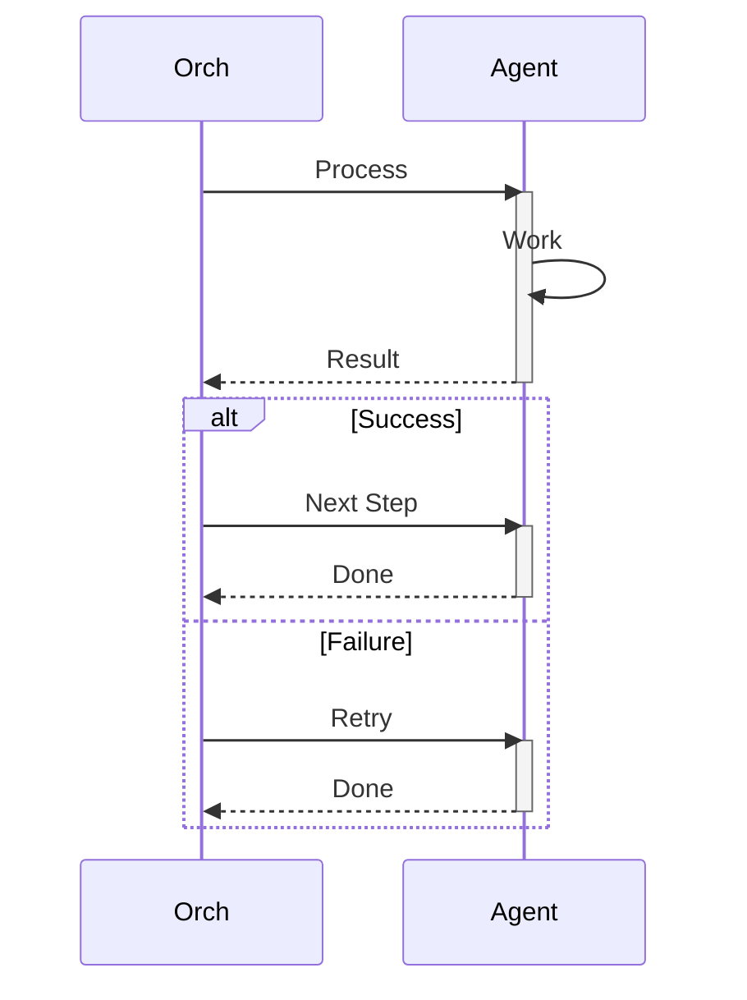
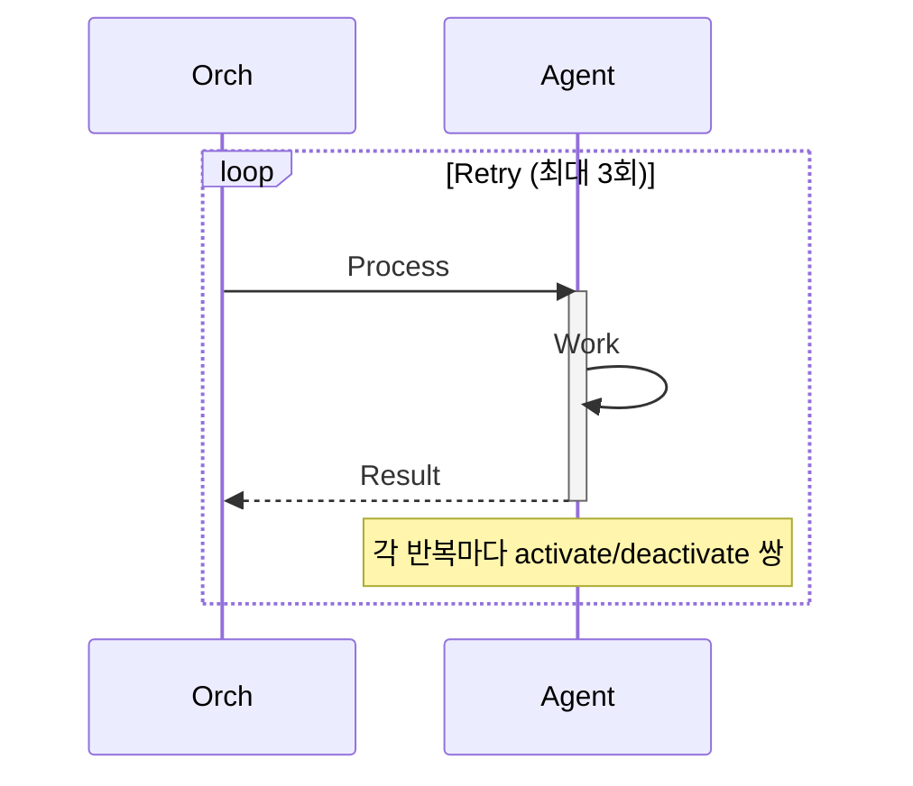
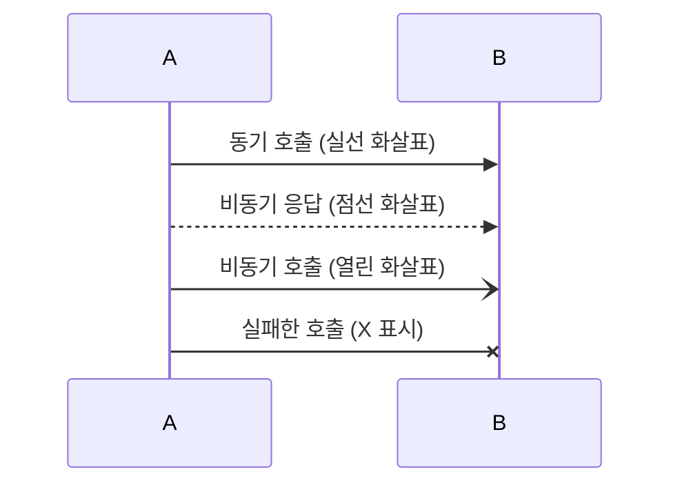
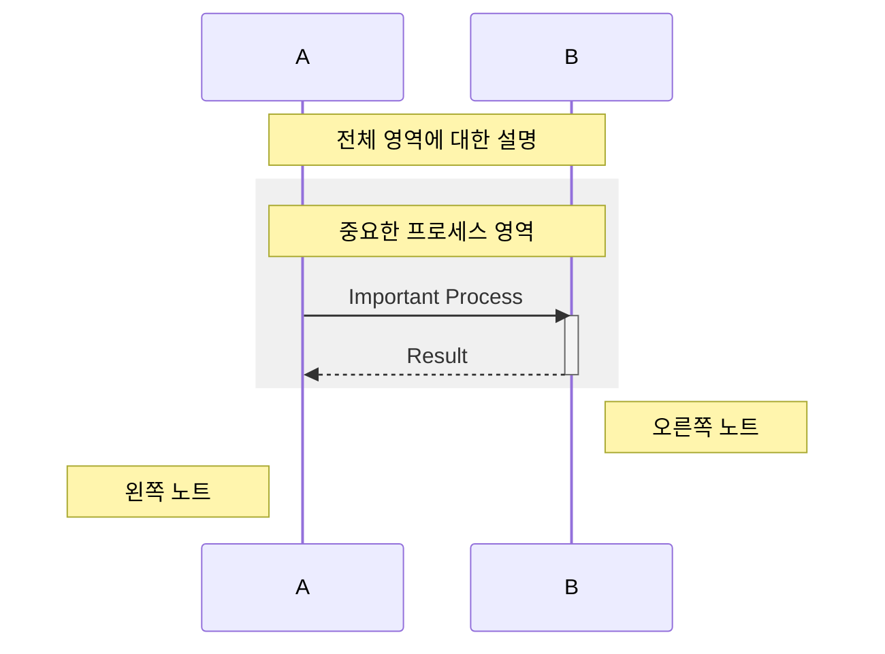

# Sequence Diagram (시퀀스 다이어그램)

Agent 간 시간 순서에 따른 메시지 흐름을 표현합니다.

## 기본 문법



## activate/deactivate 베스트 프랙티스

**중요: activate와 deactivate는 반드시 쌍을 이뤄야 합니다.**

### 올바른 예제



### 잘못된 예제 (오류 발생!)

```
sequenceDiagram
    participant A
    participant B

    A->>B: Call
    activate B
    B->>B: Process
    B-->>A: Return
    # deactivate 누락 - 오류!
```

## alt/loop 블록에서의 activate/deactivate

**핵심 규칙: alt/loop 블록 내에서 activate/deactivate를 하면 각 분기마다 상태가 달라집니다.**

### 방법 1: 블록 전에 deactivate (권장)



### Loop 올바른 사용법



## 메시지 타입



## Note와 Rect 활용



## 일반적인 오류와 해결책

### 오류 1: "Trying to inactivate an inactive participant"

**원인**: 이미 deactivate된 participant를 다시 deactivate 시도

**해결책**:
```
✅ 올바른 코드:
    activate Agent
    # ... 작업 ...
    deactivate Agent
    # 다시 사용 시 재활성화
    activate Agent
    # ... 작업 ...
    deactivate Agent
```

### 오류 2: alt 블록에서 상태 불일치

**원인**: alt 분기마다 activate/deactivate 상태가 달라짐

**해결책**: alt 블록 **전에** deactivate
```
✅ 올바른 패턴:
    activate Agent
    Agent-->>Orch: Result
    deactivate Agent  # alt 블록 전에 deactivate!

    alt Case1
        # 필요 시 재활성화
    else Case2
        # 필요 시 재활성화
    end
```
