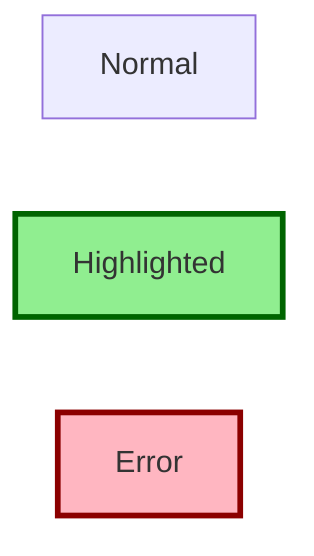
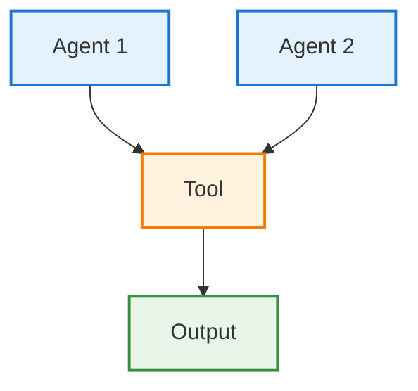
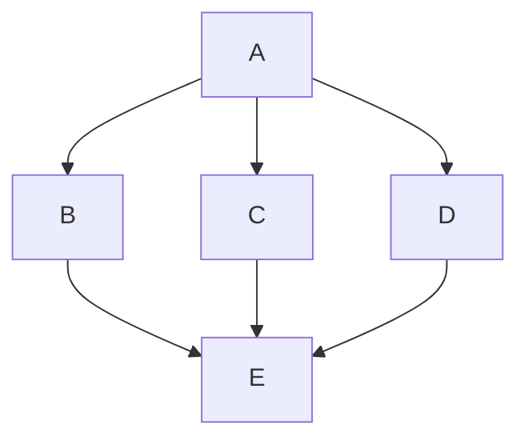
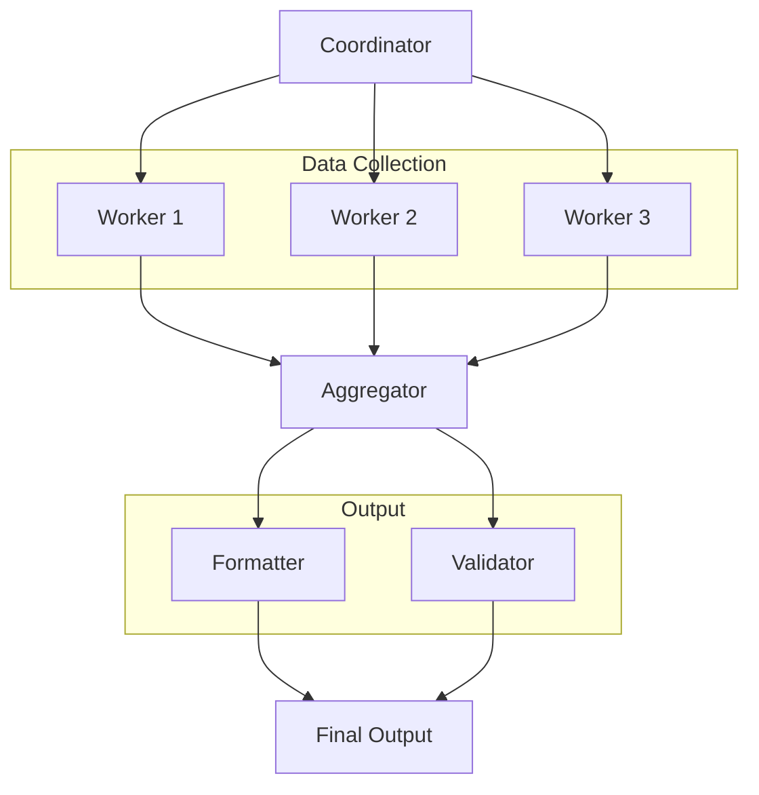

# Mermaid 스타일링

## 노드 스타일



**코드:**
```
style B fill:#90EE90,stroke:#006400,stroke-width:3px
style C fill:#FFB6C1,stroke:#8B0000,stroke-width:3px
```

## 클래스 정의



## Agent vs Tool 구분

```
classDef agent fill:#E3F2FD,stroke:#1976D2
classDef tool fill:#FFF3E0,stroke:#F57C00

A[Agent]:::agent --> B[Tool]:::tool
```

## 서브그래프로 복잡한 Graph 단순화

### Before (복잡)


### After (서브그래프 사용)


## 색상 팔레트 권장

| 용도 | Fill | Stroke |
|------|------|--------|
| Agent | #E3F2FD | #1976D2 |
| Tool | #FFF3E0 | #F57C00 |
| Output | #E8F5E9 | #388E3C |
| Error | #FFB6C1 | #8B0000 |
| Decision | #FFF3E0 | #F57C00 |
