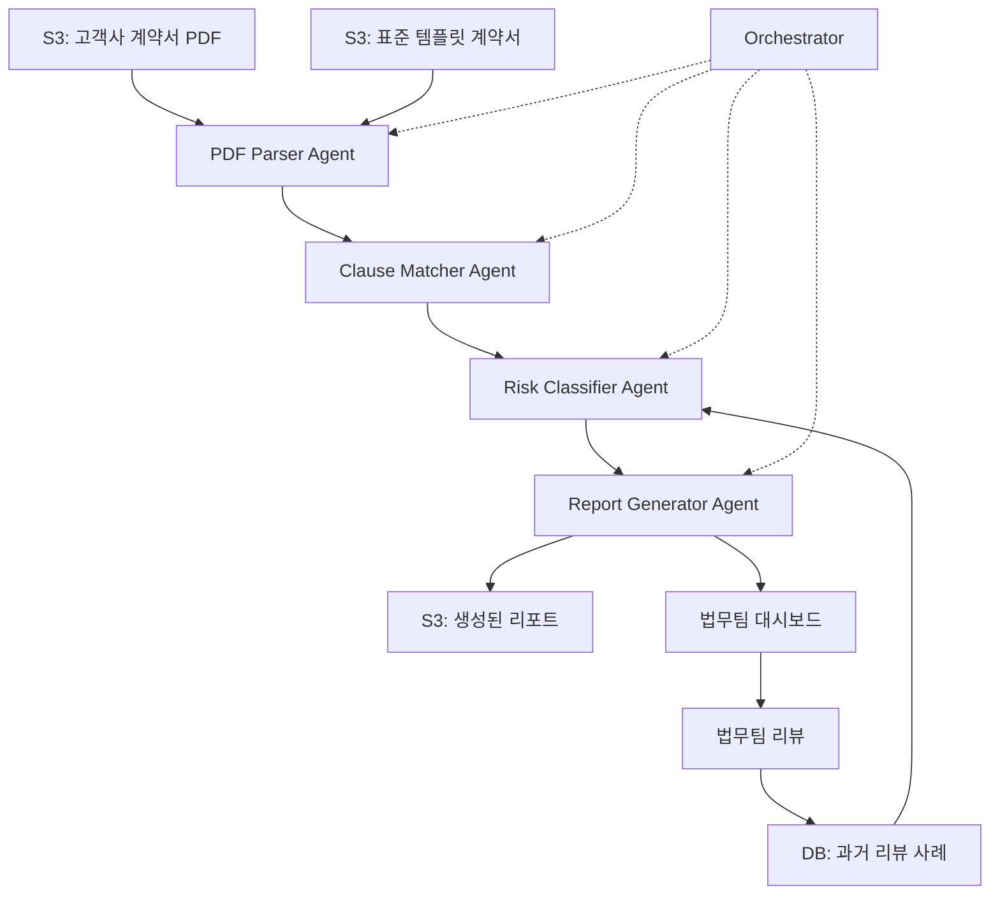
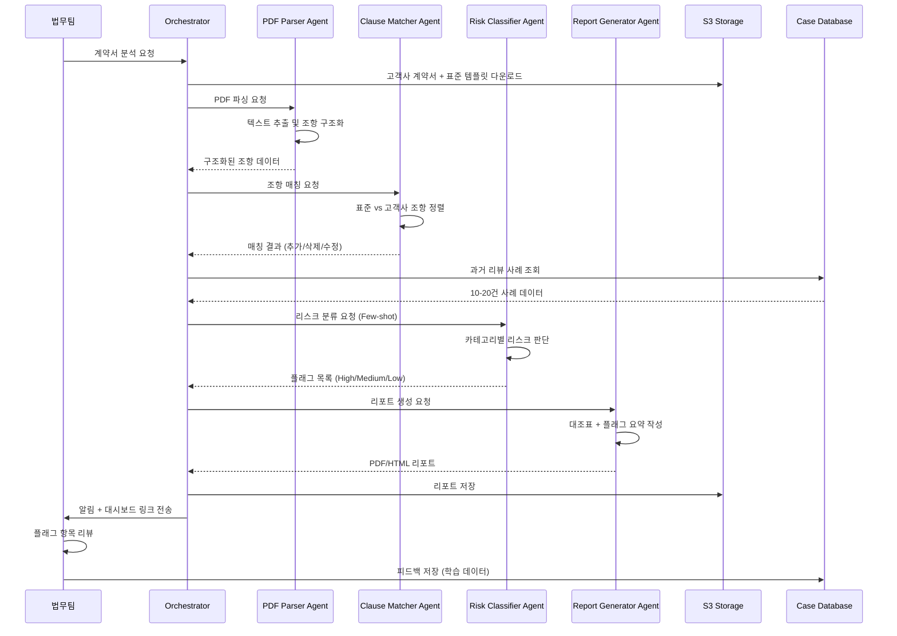
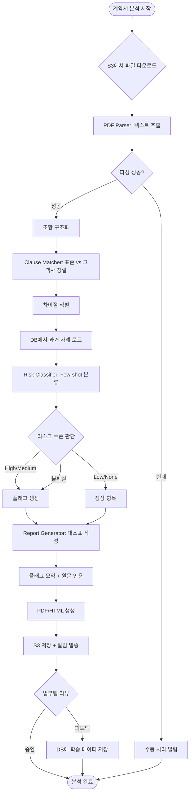

# AI Agent Design Specification

## 1. Executive Summary
- **Problem**: 고객사 계약서와 표준 계약서 비교 시 법무팀의 암묵적 지식에 의존하여 리스크 판단 기준이 불명확하고, 조항별 대조 및 리스크 분석에 2시간 소요되어 업무 효율성 저하
- **Solution**: Planning + Tool Use 패턴 기반으로 PDF 파싱, 조항 매칭, Few-shot 리스크 분류를 순차 실행하고, 보수적 플래그 전략으로 False Negative를 최소화하며 법무팀 최종 리뷰로 정확도 개선
- **Feasibility Score**: 40/50 (High Feasibility)
- **Go/No-Go**: **Go** - 2주 프로토타입 즉시 착수 권장. 초기 목표는 처리 시간 2시간→30분 단축 및 명백한 리스크 100% 포착

## 2. Problem Decomposition

### INPUT
- **트리거 타입**: Scheduled/On-Demand (법무팀이 S3에 고객사 계약서 업로드 시 또는 수동 요청 시)
- **데이터 소스**: 
  - S3 저장된 고객사 계약서 PDF
  - 단일 표준 템플릿 계약서 (특약 추가 형태)
  - 과거 10-20건의 레이블링된 리뷰 사례 (계약서 + 법무팀 코멘트)

### PROCESS
1. **PDF 파싱**: pdfplumber를 사용하여 고객사 계약서와 표준 템플릿에서 텍스트 추출 후, 조항 구조화 (제목, 본문, 특약 분리)
2. **조항 매칭**: 표준 템플릿의 각 조항과 고객사 계약서 조항을 자동 정렬하고, 추가/삭제/수정된 조항 식별
3. **Few-shot 리스크 분류**: 10-20건 과거 사례를 프롬프트에 포함하여 손해배상/계약해지/기밀유지 3개 카테고리별로 리스크 수준 판단 (High/Medium/Low/None)
4. **플래그 생성**: False Negative 최소화를 위해 Medium 이상 또는 불확실한 조항은 모두 플래그 처리
5. **대조표 및 리포트 생성**: 조항별 비교표 + 플래그된 항목 요약 + 원문 인용 포함한 1차 스크리닝 리포트 작성 (PDF/HTML)
6. **법무팀 리뷰**: 플래그된 조항에 대해 법무팀이 최종 판단 및 피드백 제공 (향후 학습 데이터로 활용)

### OUTPUT
- **결과물 타입**: Structured Report
- **형식**: 
  - 조항별 대조표 (표준 vs 고객사, 차이점 하이라이트)
  - 리스크 플래그 목록 (손해배상/계약해지/기밀유지 카테고리별 분류)
  - 원문 인용 포함 1차 스크리닝 리포트 (PDF/HTML)
  - 법무팀 리뷰 필요 항목 하이라이트
- **전달 방법**: S3 저장 + 법무팀 이메일/슬랙 알림 + 웹 대시보드 링크

### Human-in-Loop
- **개입 시점**: 5단계 리포트 생성 후, 플래그된 조항에 대한 최종 판단
- **방법**: 웹 인터페이스를 통해 각 플래그 항목에 대해 Approve/Reject/Modify 선택 및 코멘트 입력, 피드백은 자동으로 학습 데이터베이스에 저장

## 3. Architecture

### 3.1 System Architecture

### 3.2 Sequence Diagram

### 3.3 Flow Chart

## 4. Agent Components

| Agent Name | Role | Input | Output | LLM | Tools |
|------------|------|-------|--------|-----|-------|
| **Orchestrator** | 전체 워크플로우 조율 및 단계별 에이전트 실행 순서 관리 | 계약서 분석 요청 (S3 경로) | 최종 리포트 경로 + 실행 로그 | Claude Sonnet 4.5 | S3 SDK, Agent 호출 API |
| **PDF Parser Agent** | PDF에서 텍스트 추출 및 조항 구조화 (제목, 본문, 특약 분리) | 고객사 계약서 PDF + 표준 템플릿 PDF | 구조화된 조항 데이터 (JSON) | Claude Haiku 4.5 | pdfplumber, 정규표현식 |
| **Clause Matcher Agent** | 표준 템플릿과 고객사 계약서 조항 자동 정렬 및 차이점 식별 | 구조화된 조항 데이터 (표준 + 고객사) | 매칭 결과 (추가/삭제/수정 조항 목록) | Claude Sonnet 4.5 | 텍스트 유사도 계산 (difflib) |
| **Risk Classifier Agent** | Few-shot learning으로 손해배상/계약해지/기밀유지 카테고리별 리스크 수준 판단 | 매칭 결과 + 과거 10-20건 사례 | 조항별 리스크 수준 (High/Medium/Low/None) + 플래그 목록 | Claude Opus 4.5 | Few-shot 프롬프트, DB 조회 |
| **Report Generator Agent** | 조항별 대조표, 플래그 요약, 원문 인용 포함한 1차 스크리닝 리포트 생성 | 매칭 결과 + 플래그 목록 + 원문 데이터 | PDF/HTML 리포트 | Claude Sonnet 4.5 | HTML 템플릿, PDF 변환 (WeasyPrint) |

## 5. Technical Stack

- **Framework**: 
  - **Strands SDK**: 멀티 에이전트 오케스트레이션, Planning 패턴 구현, Tool Use 통합, 에이전트 간 상태 관리 및 에러 핸들링 지원
  - **이유**: Planning + Tool Use 패턴에 최적화된 프레임워크로, PDF 파싱→조항 매칭→리스크 분류→리포트 생성의 순차적 워크플로우를 선언적으로 정의 가능하며, 외부 도구(pdfplumber, difflib 등) 통합이 용이함

- **LLM**: 
  - **Claude Opus 4.5**: Risk Classifier Agent에서 Few-shot learning 기반 복잡한 리스크 판단 수행
    - **용도**: 과거 사례를 참조하여 손해배상/계약해지/기밀유지 카테고리별 리스크 수준 분류 (High/Medium/Low/None)
    - **이유**: 가장 높은 추론 능력으로 edge case 처리 및 법률 용어 이해도가 뛰어나며, Few-shot learning 정확도가 가장 높음
  
  - **Claude Sonnet 4.5**: Orchestrator, Clause Matcher Agent, Report Generator Agent에서 중간 복잡도 작업 수행
    - **용도**: 워크플로우 조율, 조항 정렬 및 차이점 식별, 구조화된 리포트 생성
    - **이유**: 속도와 정확도의 균형이 우수하여 반복적인 매칭 작업과 리포트 생성에 적합하며, 비용 효율적
  
  - **Claude Haiku 4.5**: PDF Parser Agent에서 단순 텍스트 추출 및 구조화 작업 수행
    - **용도**: PDF 텍스트 추출 후 조항 제목/본문/특약 분리
    - **이유**: 가장 빠른 응답 속도와 낮은 비용으로 단순 파싱 작업에 최적화되어 있으며, 구조화 작업에 충분한 성능 제공