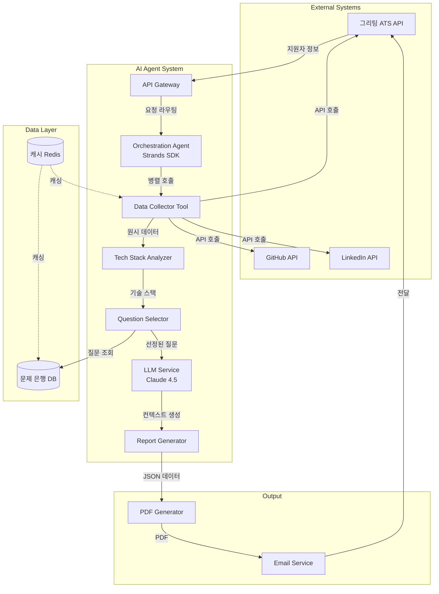
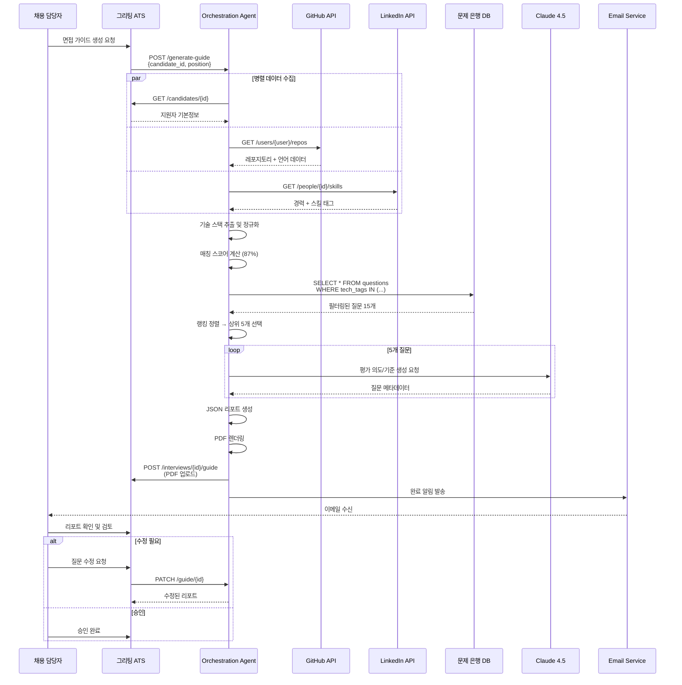
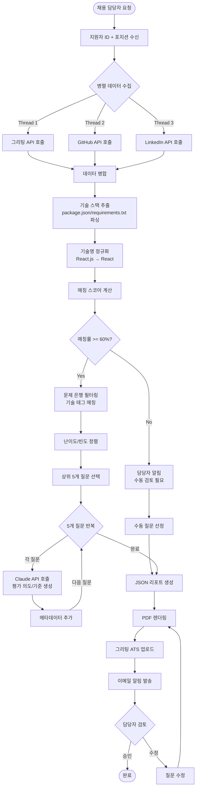

# AI Agent Design Specification

## 1. Executive Summary
- **Problem**: 채용 담당자가 지원자당 30-60분씩 GitHub/LinkedIn을 수동 확인하고 100개 문제 은행에서 기술면접 질문을 선별하는 비효율적 프로세스로 인해 기술 스택 미스매치 빈번 발생
- **Solution**: Tool Use 패턴 기반 자동화 에이전트로 3개 API(그리팅, GitHub, LinkedIn) 병렬 호출 → 기술 스택 추출 및 매칭 → 문제 은행 필터링 → 맞춤형 면접 가이드 생성
- **Feasibility Score**: 41/50 (High Feasibility)
- **Go/No-Go**: **즉시 프로토타입 시작 권장** - 표준 REST API 통합으로 1주일 내 MVP 완성 가능, 10명 파일럿 테스트 후 확장

## 2. Problem Decomposition

### INPUT
- **트리거 타입**: API 호출 (REST Endpoint)
- **트리거 상세**: 채용 담당자가 ATS 시스템에서 "면접 가이드 생성" 버튼 클릭 시 지원자 ID와 포지션 정보 전달
- **데이터 소스**:
  1. 그리팅 ATS REST API: 지원자 기본정보(이름, 이메일, 지원 포지션, GitHub/LinkedIn URL)
  2. GitHub REST API v3: 레포지토리 목록, 커밋 히스토리(최근 6개월), 사용 언어, package.json/requirements.txt 파일
  3. LinkedIn API: 경력 정보, 스킬 태그, 추천 기술
  4. 내부 문제 은행 DB: 100개 질문(ID, 질문 내용, 기술스택 태그, 난이도, 사용 빈도)

### PROCESS
1. **데이터 수집 (병렬 실행)**
   - 그리팅 API 호출: `GET /api/candidates/{id}` → 지원자 기본정보 및 포지션 요구사항 조회
   - GitHub API 호출: `GET /users/{username}/repos` + `GET /repos/{owner}/{repo}/languages` → 최근 6개월 활동 레포지토리 및 사용 언어 통계 수집
   - LinkedIn API 호출: `GET /v2/people/{id}/skills` → 경력 기간, 스킬 태그, 인증 정보 추출

2. **기술 스택 추출 및 정규화**
   - GitHub 데이터 파싱: 레포지토리별 언어 비율 집계 → 상위 언어 추출
   - 의존성 파일 분석: package.json(Node.js), requirements.txt(Python), pom.xml(Java) 파싱 → 프레임워크/라이브러리 식별
   - LinkedIn 스킬 태그 매핑: 자유 형식 스킬명 → 표준 기술명 정규화 (예: "React.js" → "React")
   - 최종 기술 스택 리스트 생성: 3-5개 주요 기술 + 신뢰도 점수 (GitHub 활동량 기반)

3. **프로필 매칭 스코어링**
   - 포지션 요구사항 파싱: Job Description에서 필수/우대 기술 추출
   - 매칭률 계산: (후보자 보유 기술 ∩ 요구 기술) / 요구 기술 × 100
   - 가중치 적용: 필수 기술 80%, 우대 기술 20%
   - 미스매치 기술 식별: 요구되지만 보유하지 않은 기술 리스트

4. **질문 필터링 및 랭킹**
   - 1차 필터: 문제 은행에서 매칭된 기술 스택 태그 질문만 추출 (SQL WHERE 조건)
   - 2차 정렬: 난이도(포지션 레벨 기준) → 사용 빈도(높은 순) → 최신성
   - 다양성 보장: 동일 기술 카테고리 중복 방지 (최대 2개)
   - 상위 5개 질문 선택

5. **질문 컨텍스트 생성 (LLM 활용)**
   - 각 질문에 대해 Claude API 호출
   - 프롬프트: "지원자 기술 스택({tech_stack})을 고려해 이 질문({question})의 평가 의도, 핵심 평가 포인트 3가지, 우수 답변 예시를 생성하세요"
   - 출력: 질문별 메타데이터(의도, 평가기준, 예상답변, 후속질문)

6. **리포트 생성 및 전달**
   - JSON 구조화: 후보자 요약 섹션 + 5개 질문 섹션 + 면접 가이드 섹션
   - PDF 렌더링: HTML 템플릿 + 데이터 바인딩 → PDF 변환
   - 그리팅 API 콜백: `POST /api/interviews/{id}/guide` → 생성된 가이드 업로드
   - 이메일 알림: 채용 담당자에게 완료 통지 + 다운로드 링크

### OUTPUT
- **결과물 타입**: Structured Report (JSON + PDF)
- **형식**:
  ```json
  {
    "candidate_summary": {
      "name": "홍길동",
      "position": "Senior Backend Engineer",
      "tech_stack": ["Python", "Django", "PostgreSQL", "Docker", "AWS"],
      "match_score": 87,
      "experience_highlight": "3년 Django 기반 API 개발, AWS 인프라 구축 경험"
    },
    "interview_questions": [
      {
        "id": 42,
        "question": "Django ORM N+1 문제 해결 방법은?",
        "tech_tags": ["Python", "Django"],
        "difficulty": "중급",
        "evaluation_intent": "쿼리 최적화 이해도 검증",
        "key_points": ["select_related/prefetch_related 차이", "실제 프로젝트 적용 사례", "성능 측정 방법"],
        "expected_answer": "select_related는 JOIN, prefetch_related는 별도 쿼리...",
        "time_allocation": "10분"
      }
    ],
    "interview_guide": {
      "total_time": "50분",
      "focus_areas": ["API 설계", "데이터베이스 최적화"],
      "red_flags": ["AWS 경험 부족"]
    }
  }
  ```
- **전달 방법**:
  1. 그리팅 ATS 시스템 내 "면접 가이드" 탭에 자동 업로드
  2. 채용 담당자 이메일로 PDF 첨부 발송
  3. Slack 채널에 요약 메시지 + 링크 게시 (선택)

### Human-in-Loop
- **개입 시점**: Review (생성 후 검토)
- **방법**:
  1. **자동 생성 후 검토 단계**: 채용 담당자가 리포트 확인 → "승인" 또는 "수정 요청" 버튼 클릭
  2. **수정 인터페이스**: 질문 추가/삭제/순서 변경, 평가 기준 수정 가능
  3. **피드백 루프**: 수정 사항을 학습 데이터로 저장 → 질문 선정 알고리즘 개선에 활용
  4. **긴급 개입**: 매칭률 60% 미만 시 자동 알림 → 담당자가 수동 질문 선정 여부 결정

## 3. Architecture

### 3.1 System Architecture


### 3.2 Sequence Diagram


### 3.3 Flow Chart


## 4. Agent Components

| Agent Name | Role | Input | Output | LLM | Tools |
|------------|------|-------|--------|-----|-------|
| **Orchestration Agent** | 전체 워크플로우 조율 및 도구 호출 관리 | 지원자 ID, 포지션 정보 | 최종 면접 가이드 JSON | Claude 4.5 Sonnet | - API Caller Tool<br/>- Tech Stack Analyzer Tool<br/>- Question Selector Tool<br/>- Report Generator Tool |
| **API Caller Tool** | 외부 API 병렬 호출 및 에러 핸들링 | API 엔드포인트, 파라미터 | 원시 JSON 데이터 (지원자 정보, GitHub 활동, LinkedIn 프로필) | N/A (도구) | - HTTP Client<br/>- Rate Limiter<br/>- Retry Logic |
| **Tech Stack Analyzer Tool** | 기술 스택 추출 및 정규화 | GitHub 레포지토리 데이터, LinkedIn 스킬 태그 | 정규화된 기술 스택 리스트 (3-5개) + 신뢰도 점수 | N/A (도구) | - Language Parser<br/>- Dependency File Parser<br/>- Skill Normalizer |
| **Question Selector Tool** | 문제 은행 필터링 및 랭킹 | 기술 스택, 포지션 레벨, 매칭 스코어 | 선정된 5개 질문 ID + 메타데이터 | N/A (도구) | - SQL Query Builder<br/>- Ranking Algorithm<br/>- Diversity Filter |
| **Context Enrichment Agent** | 질문별 평가 의도 및 기준 생성 | 질문 내용, 지원자 기술 스택 | 평가 의도, 핵심 포인트 3가지, 예상 답변, 후속 질문 | Claude 4.5 Haiku | - Prompt Template Engine |
| **Report Generator Tool** | JSON → PDF 변환 및 포맷팅 | 구조화된 JSON 데이터 | PDF 파일 + 이메일 본문 | N/A (도구) | - HTML Template Engine<br/>- PDF Renderer<br/>- Email Formatter |

## 5. Technical Stack

- **Framework**:
  - **Strands SDK**: 에이전트 오케스트레이션 및 도구 통합 관리
    - 이유: Tool Use 패턴에 최적화된 프레임워크로 외부 API 호출, 에러 핸들링, 병렬 처리를 선언적으로 구현 가능. 복잡한 상태 관리 없이 선형 워크플로우 구성에 적합하며, 프로토타입 빠른 구축 지원.

- **LLM**: 
  - **Claude 4.5 Sonnet (Orchestration Agent)**: 전체 워크플로우 조율 및 의사결정
    - 용도: 데이터 수집 결과 해석, 매칭 스코어 임계값 판단, 도구 호출 순서 결정
    - 이유: 복잡한 멀티스텝 추론과 도구 사용에 최적화되어 있으며, 비용 대비 성능 균형이 우수해 프로토타입 단계에 적합
  
  - **Claude 4.5 Haiku (Context Enrichment Agent)**: 질문별 평가 기준 생성
    - 용도: 5개 질문에 대한 평가 의도, 핵심 포인트, 예상 답변 자동 생성
    - 이유: 단순 텍스트 생성 작업으로 빠른 응답 속도와 낮은 비용이 중요. 반복 호출(5회)이 필요하므로 경량 모델로 레이턴시 최소화