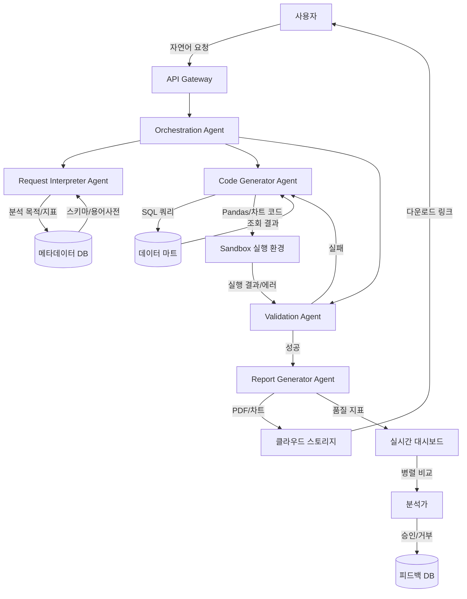
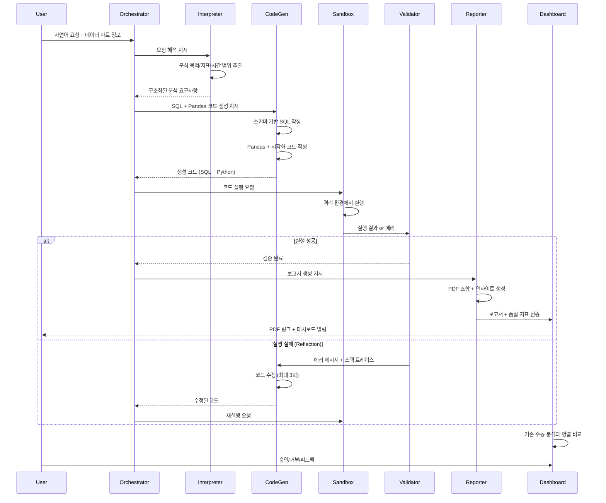
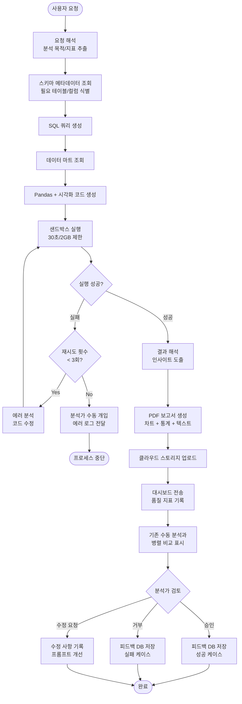

# AI Agent Design Specification

## 1. Executive Summary
- **Problem**: 데이터 분석 요청마다 Pandas 코드 작성, 차트 생성, 인사이트 도출을 수동으로 반복하는 비효율적 프로세스로 인해 분석가의 시간이 과도하게 소요되고, 복잡한 시각화(히트맵, 박스플롯) 생성 시 오류율이 높아 분석 품질이 불안정함
- **Solution**: Reflection + Tool Use 패턴을 활용하여 자연어 요청을 Pandas 코드로 자동 변환하고, 샌드박스 실행 결과를 기반으로 코드를 자가 수정하며, DB 조회/차트 생성 도구를 통합하여 PDF 보고서까지 자동 생성
- **Feasibility Score**: 37/50 (중간 수준 - 프로토타입 적합)
- **Go/No-Go**: **조건부 Go** - 그림자 모드로 3-6개월 검증 후 점진적 자동화 전환. 초기에는 간단한 분석부터 시작하여 Reflection 성공률 85% 달성 후 고급 분석 확대

## 2. Problem Decomposition

### INPUT
- **트리거 타입**: Structured + Natural Language (하이브리드)
- **상세 설명**:
  1. 사용자 자연어 요청: "지난 3개월 매출 트렌드와 상위 5개 제품군 비교 분석"
  2. 읽기 전용 데이터 마트: 조인 완료된 분석용 테이블 (sales_fact, product_dim 등)
  3. DB 스키마 메타데이터: 테이블명, 컬럼명, 데이터 타입, 관계 정보
  4. 비즈니스 용어 사전: "매출 = revenue_amount", "전환율 = conversion_rate" 등 도메인 정의
- **데이터 소스**: 
  - 클라우드 데이터 웨어하우스 (읽기 전용 계정)
  - 메타데이터 저장소 (스키마 정보, 용어 사전)

### PROCESS
1. **요청 해석**: LLM이 자연어 요청을 파싱하여 분석 목적(트렌드/비교/예측), 시간 범위(3개월), 관심 지표(매출), 그룹핑 기준(제품군)으로 분해
2. **데이터 조회**: DB 스키마 메타데이터를 참조하여 필요한 테이블(sales_fact)과 컬럼(revenue_amount, product_category, date) 식별 후 SQL 쿼리 생성 및 실행
3. **코드 생성**: LLM이 조회된 데이터를 기반으로 Pandas 분석 코드(groupby, pivot_table) + matplotlib/plotly 시각화 코드(line chart, bar chart) 작성
4. **샌드박스 실행**: Docker 격리 환경에서 생성된 코드 실행. 실행 시간 제한(30초), 메모리 제한(2GB), 네트워크 차단 적용
5. **오류 검증**: 실행 실패 시 에러 메시지(KeyError, TypeError, ValueError 등)와 스택 트레이스를 LLM에 전달하여 코드 수정. 최대 3회 반복
6. **결과 해석**: LLM이 Pandas 출력(통계 테이블, 수치 결과)과 생성된 차트를 분석하여 비즈니스 인사이트 도출 ("제품군 A가 20% 성장, 계절성 패턴 발견")
7. **PDF 생성**: 분석 요약, 통계 테이블, 차트 이미지, 인사이트 텍스트를 템플릿 기반으로 구조화된 PDF 보고서로 조합
8. **그림자 모드 배포**: 생성된 보고서를 실시간 대시보드에 전송하여 기존 수동 분석 결과와 병렬 비교. 품질 지표(실행 성공률, Reflection 횟수) 추적

### OUTPUT
- **결과물 타입**: Structured Document + Visualization
- **형식**:
  - PDF 보고서 (A4, 5-15페이지)
    - 섹션 1: 분석 요약 (1페이지)
    - 섹션 2: 통계 테이블 (2-3페이지)
    - 섹션 3: 차트 5-10개 (히트맵, 라인, 바, 박스플롯 등)
    - 섹션 4: 인사이트 및 권장사항 (2-3페이지)
  - 실시간 알림: 이상 패턴 감지 시 Slack/이메일 전송
- **전달 방법**:
  - PDF 다운로드 링크 (클라우드 스토리지)
  - 대시보드 임베딩 (iframe)
  - API 엔드포인트 (/api/reports/{report_id})

### Human-in-Loop
- **개입 시점**: Review (사후 검증)
- **방법**:
  1. **그림자 모드 단계**: 생성된 보고서를 실시간 대시보드에서 기존 수동 분석과 나란히 표시. 분석가가 정확도, 차트 품질, 인사이트 적절성 평가 (승인/거부/수정 요청)
  2. **Reflection 실패 시**: 3회 반복 후에도 코드 실행 실패 시 분석가에게 에러 로그와 생성 코드 전달하여 수동 개입 요청
  3. **고급 분석 검증**: 예측/이상 탐지 결과는 도메인 전문가가 주간 리뷰를 통해 모델 선택 적절성 검증
  4. **피드백 루프**: 승인/거부 데이터를 학습 데이터로 수집하여 프롬프트 개선

## 3. Architecture

### 3.1 System Architecture

### 3.2 Sequence Diagram

### 3.3 Flow Chart

## 4. Agent Components

| Agent Name | Role | Input | Output | LLM | Tools |
|------------|------|-------|--------|-----|-------|
| **Request Interpreter Agent** | 자연어 요청을 구조화된 분석 요구사항으로 변환 | - 사용자 자연어 요청 - 비즈니스 용어 사전 - DB 스키마 메타데이터 | - 분석 목적 (트렌드/비교/예측) - 관심 지표 리스트 - 시간 범위 - 그룹핑 기준 | Claude 4.5 Sonnet | - 용어 사전 검색 도구 - 스키마 조회 도구 |
| **Code Generator Agent** | SQL 쿼리 및 Pandas/시각화 코드 생성 | - 구조화된 분석 요구사항 - 데이터 마트 스키마 - 이전 실행 에러 (Reflection 시) | - SQL 쿼리 - Pandas 분석 코드 - matplotlib/plotly 시각화 코드 | Claude 4.5 Opus | - SQL 실행 도구 - 코드 템플릿 라이브러리 - 스키마 검증 도구 |
| **Validation Agent** | 코드 실행 결과 검증 및 Reflection 트리거 | - 샌드박스 실행 결과 - 에러 메시지/스택 트레이스 - 재시도 횟수 | - 검증 상태 (성공/실패) - 에러 분석 리포트 - 수정 제안 | Claude 4.5 Haiku | - AST 파서 (정적 분석) - 에러 로그 분석 도구 - 재시도 카운터 |
| **Report Generator Agent** | 분석 결과를 PDF 보고서로 조합 및 인사이트 생성 | - Pandas 출력 (통계 테이블) - 차트 이미지 파일 - 원본 분석 요청 | - PDF 보고서 - 비즈니스 인사이트 텍스트 - 이상 패턴 알림 (필요 시) | Claude 4.5 Sonnet | - PDF 생성 라이브러리 - 차트 렌더링 도구 - 템플릿 엔진 |
| **Orchestration Agent** | 전체 워크플로우 조율 및 에이전트 간 통신 관리 | - 사용자 요청 - 각 에이전트 출력 - 시스템 상태 | - 워크플로우 진행 상태 - 에이전트 호출 순서 - 최종 결과물 전달 | Claude 4.5 Haiku | - 상태 관리 저장소 - 에이전트 라우팅 - 타임아웃 관리 |

## 5. Technical Stack

- **Framework**:
  - **Strands SDK**: 멀티 에이전트 오케스트레이션, Reflection 루프 구현, Tool Use 통합을 네이티브로 지원하여 코드 생성-실행-검증 사이클을 효율적으로 관리 가능. 샌드박스 실행 환경과의 통합 인터페이스 제공으로 보안 격리 구현 용이

- **LLM**: 
  - **Claude 4.5 Opus**: Code Generator Agent 전용
    - 용도: 복잡한 Pandas 코드 및 중급 시각화(히트맵, 서브플롯) 생성
    - 이유: 높은 코드 생성 품질로 1회 성공률 최대화하여 Reflection 반복 횟수 감소. 통계 모델 선택 정확도 향상
  
  - **Claude 4.5 Sonnet**: Request Interpreter Agent, Report Generator Agent 전용
    - 용도: 자연어 요청 해석, 비즈니스 인사이트 생성, PDF 보고서 텍스트 작성
    - 이유: 균형잡힌 성능과 비용으로 자연어 이해 및 생성 작업에 최적. 도메인 용어 매핑 정확도 우수
  
  - **Claude 4.5 Haiku**: Validation Agent, Orchestration Agent 전용
    - 용도: 에러 로그 분석, 워크플로우 상태 관리, 간단한 검증 로직
    - 이유: 빠른 응답 속도로 Reflection 루프 지연 최소화. 반복 호출이 많은 검증/조율 작업에 비용 효율적